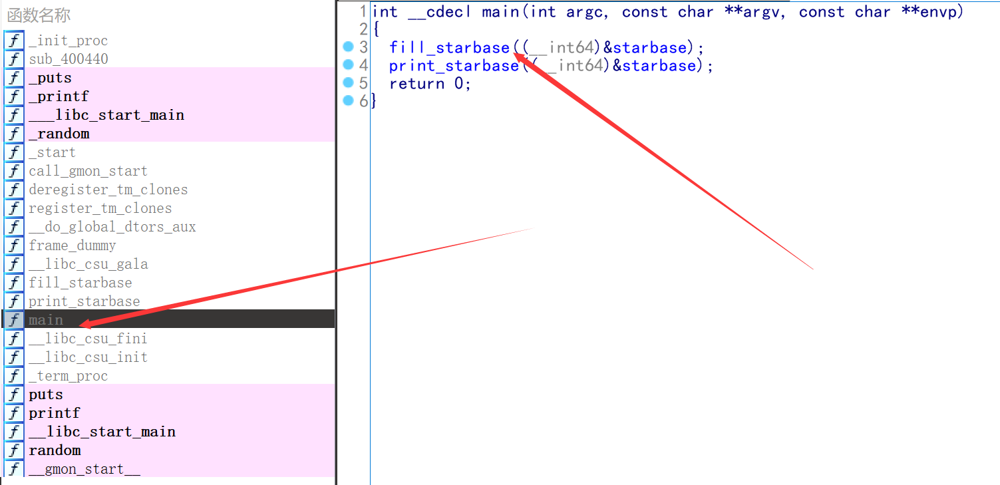

#### 运行程序,得到如下结果

#### 第一步我们习惯性的打开main函数并F5获得伪代码

#### 我们发现galaxy_name就是这些星系的名称

#### 但是我们还发现他多了一个字符串并没有参与输出,最关键的是一个叫**__libc_csu_gala**的函数引用了这几个字符串,我们转到**__libc_csu_gala函数去看一眼**

**这里可能就是生成字符串的地方**,我们分析一下

#### 分析结果如上,我们把这个字符串**aliens_are_around_us**作为flag输入居然对了.....

