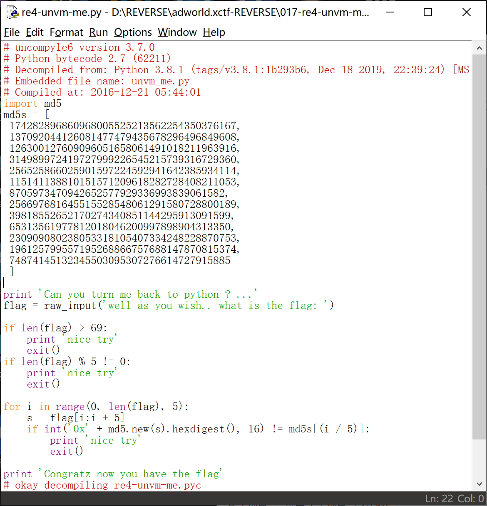
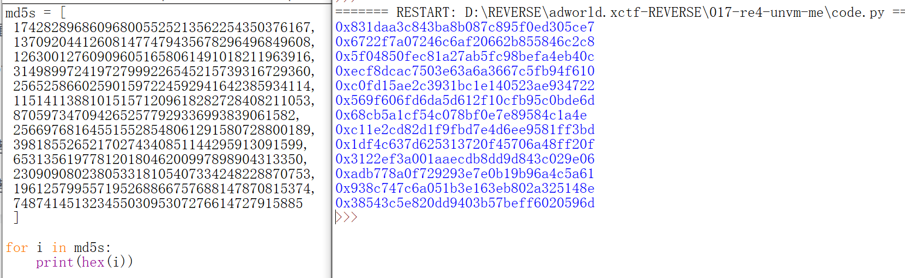

#### 反编译


#### 源代码



#### 获得md5加密的十六进制值



#### 到 cmd5.com 逐个解密

```
831daa3c843ba8b087c895f0ed305ce7
6722f7a07246c6af20662b855846c2c8
5f04850fec81a27ab5fc98befa4eb40c
ecf8dcac7503e63a6a3667c5fb94f610
c0fd15ae2c3931bc1e140523ae934722
569f606fd6da5d612f10cfb95c0bde6d
068cb5a1cf54c078bf0e7e89584c1a4e
c11e2cd82d1f9fbd7e4d6ee9581ff3bd
1df4c637d625313720f45706a48ff20f
3122ef3a001aaecdb8dd9d843c029e06
adb778a0f729293e7e0b19b96a4c5a61
938c747c6a051b3e163eb802a325148e
38543c5e820dd9403b57beff6020596d
```

```
ALEXC
TF{dv
5d4s2
vj8nk
43s8d
8l6m1
n5l67
ds9v4
1n52n
v37j4
81h3d
28n4b
6v3k}
```

