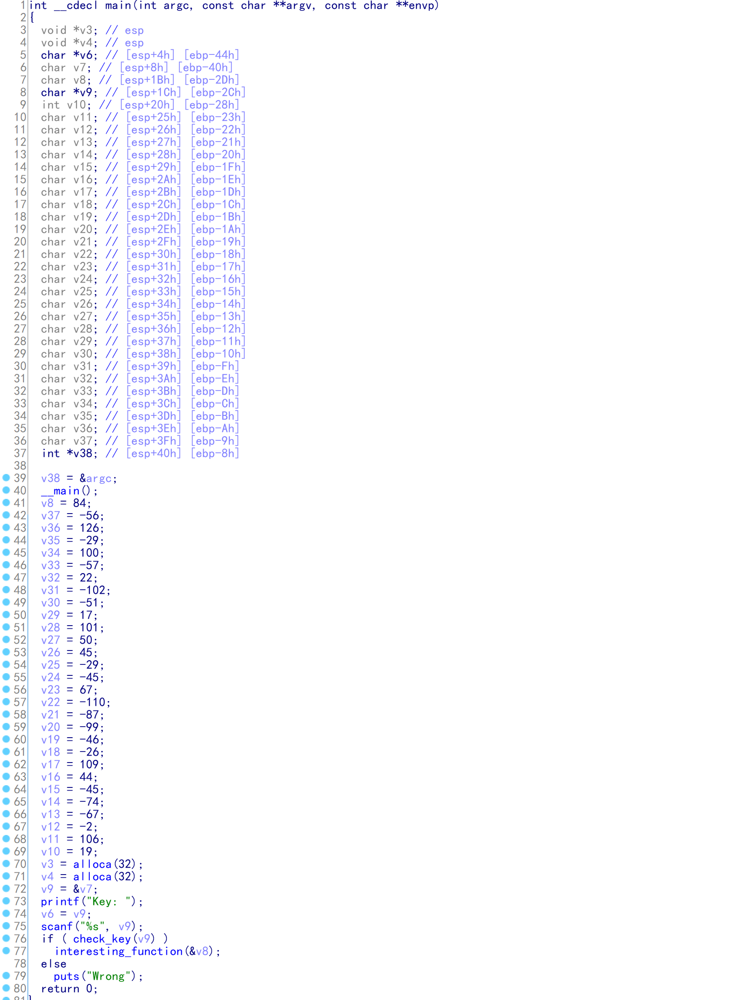
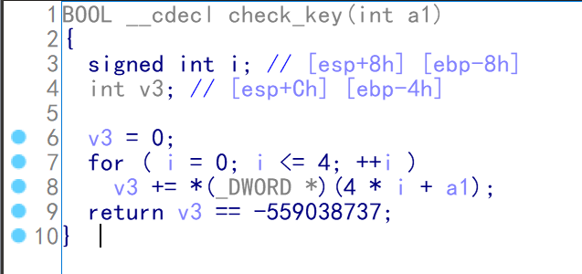
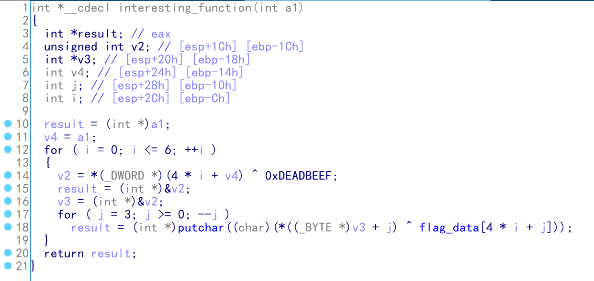
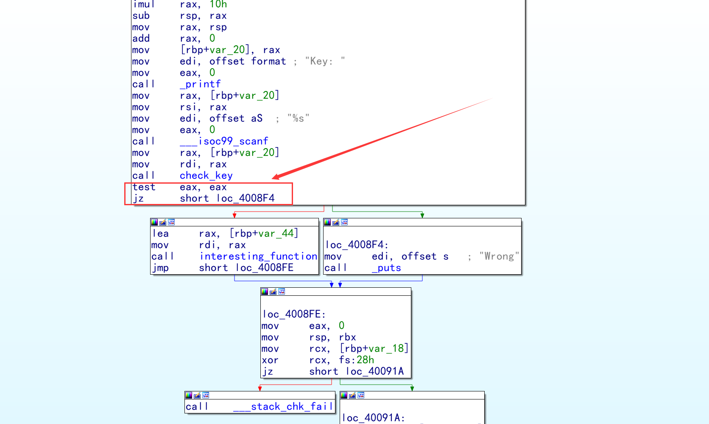
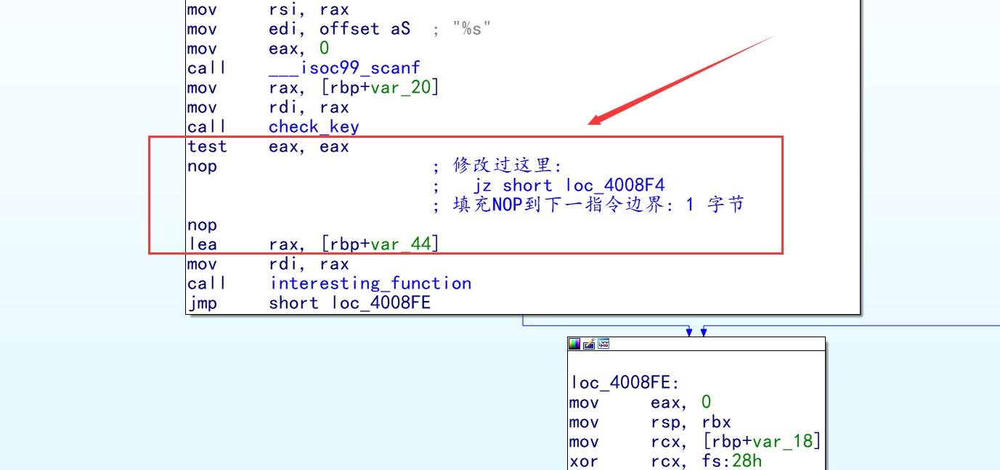

#### 老规矩有exe优先用 OD 调试 exe,但是发现 windows 的输出是乱码,所以决定用 ELF 文件写过程

#### 经过对现有变量的分析(在这里花了很多时间...),发现 check_key 和 interesting_function 是彼此独立的,也就是不论输入如何不会影响输出

#### 而进行跳转的汇编代码如下

#### 我们只需要简单的 patch 一下就可以了

#### 最后保存 patch 并输出,然后测试一下

#### 当然,不 patch 也是可以的,直接用远程调试也可以,[看雪论坛有个设置本地虚拟机为远程调试器的教程](https://bbs.pediy.com/thread-247830-1.htm)

