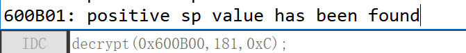

#### 老规矩F5


#### 发现主函数是 judge,双击转到


#### 我们发现主函数被加密了,但是加密方式我们可以看到(上面的循环),只需要反过来解密一下即可

```c++
// 见patch.idc
#include<idc.idc>
static decrypt(from,size,key){
    auto i,x;
    for(i=0;i<=size;i++){
        x = Byte(from);
        x = (x^key);
        PatchByte(from,x);
        from = from + 1;
    }
}
```

#### 在 IDA 中选择 文件->脚本文件,将上面的脚本加载进去,然后执行以下命令(为什么执行以下命令可以看上面的main函数伪代码的截图)



#### 然后转到 judge 主函数


#### 取消该函数的定义(即视作数据)(快捷键 U)


#### 再将其视作代码


#### 最后再创建函数


#### 这时候再 F5 获得伪代码即可


