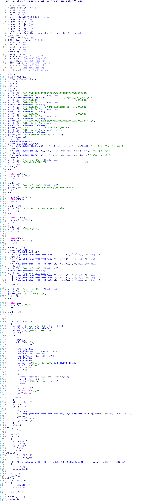
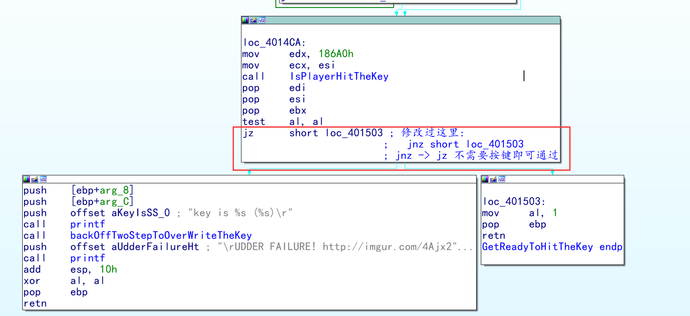
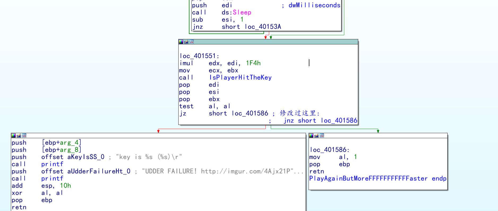

#### 分析

#### patch1: GetReadyToHitTheKey

#### patch2: PlayAgainButMoreFFFFFFFFFaster

#### 之所以它需要pathc两次是因为我们修改的是判断方式if(!IsPlayerHitTheKey(xxxxxx)),这里其实是可以选择修改这个函数的,给我们增加一点按键的反应时间(比如0x1FFFFFFF之类的)

