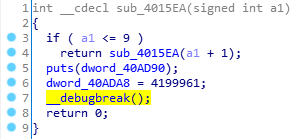
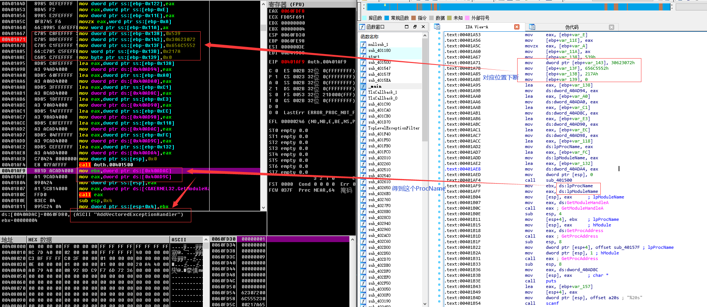
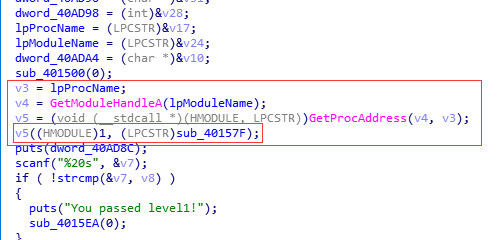
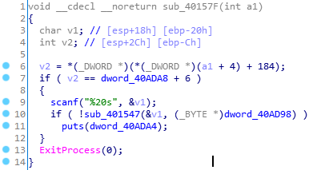
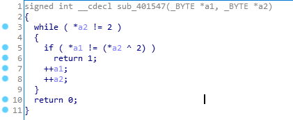
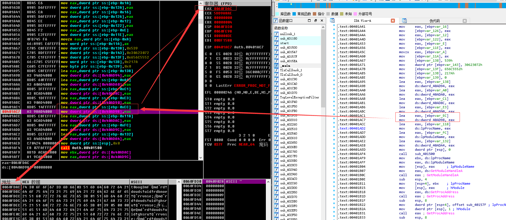
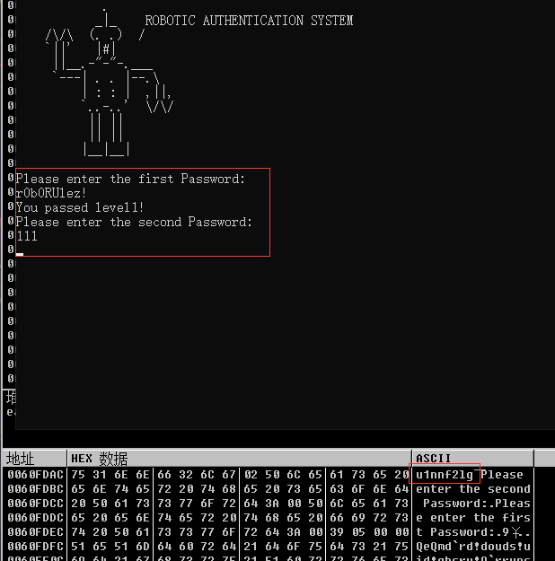

#### 没什么头绪,但是我们发现在通过 Level1 校验后,有个断点



#### 所以就想到这个什么 ProcName 会不会有什么鬼



#### 原来这个鬼东西叫 AddVectoredExceptionHandler

#### 查文档 [传送门](https://docs.microsoft.com/en-us/windows/win32/api/errhandlingapi/nf-errhandlingapi-addvectoredexceptionhandler), 作用是 Registers a vectored exception handler. 大概是异常处理吧,那么就有可能是在断点触发时调用到这个函数咯.

```c++
PVOID AddVectoredExceptionHandler(
  ULONG                       First,
  PVECTORED_EXCEPTION_HANDLER Handler
);
```




#### 这个 v5 是个函数指针,应该是把 1 和 sub_40157F 作为参数给了 AddVectoredExceptionHandler 吧

#### 这么说应该是在 __debugbreak() 之后会调用到这个函数咯



#### 可以看到有个 scanf ,感觉一下子就明了了...

#### 这个函数调用了 sub_401547



#### 其中 a1 是用户输入, a2 是一段数据,应该是要求输入的数据与 a2 的数据 ^ 2相等,接下来就是获取 dword_40AD98 的数据了



#### 继续运行程序,直到 __debugbreak() 把程序执行路径带到 sub_40157F



#### 我们注意到 sub_401547 有个 while (*a2 != 0) ,即我们需要的数据是 u1nnf2lg (即前八个字节), 然后写个代码就ok了

