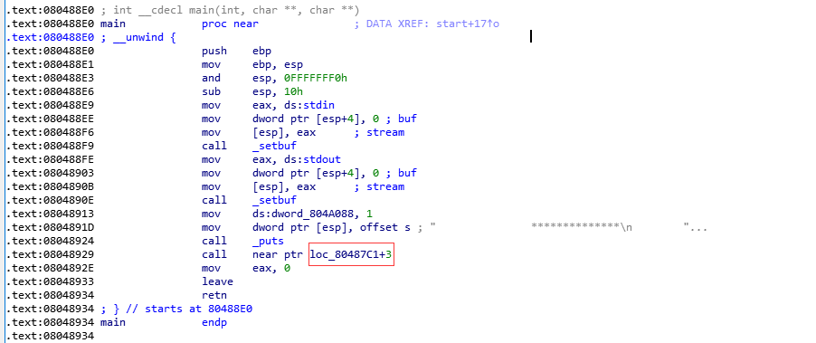
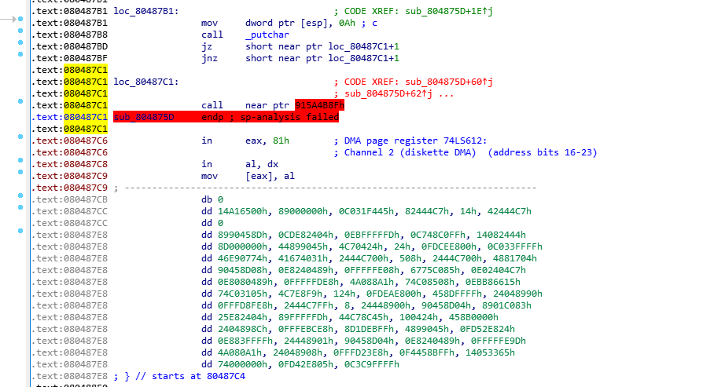
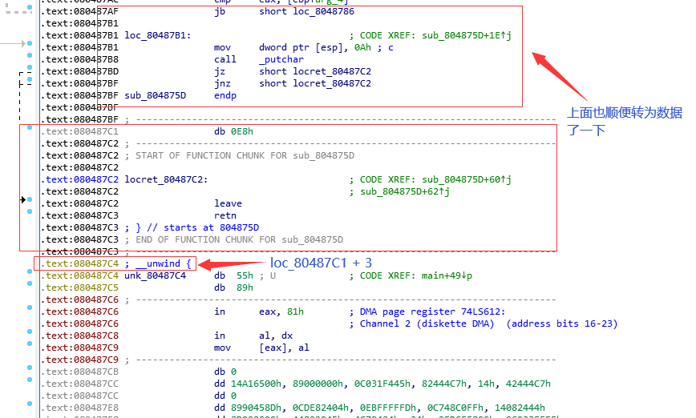
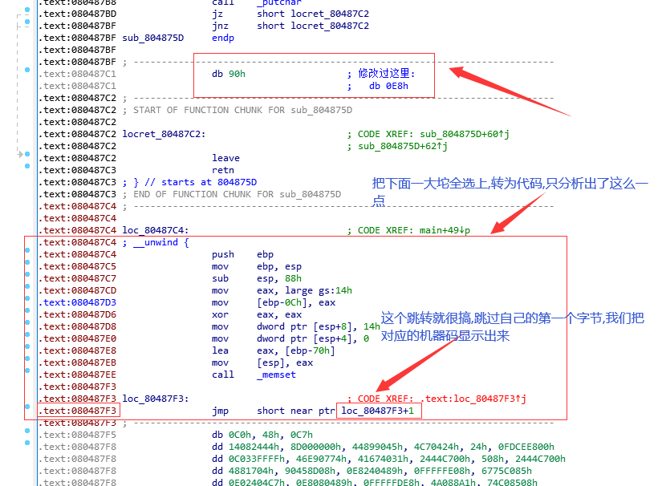
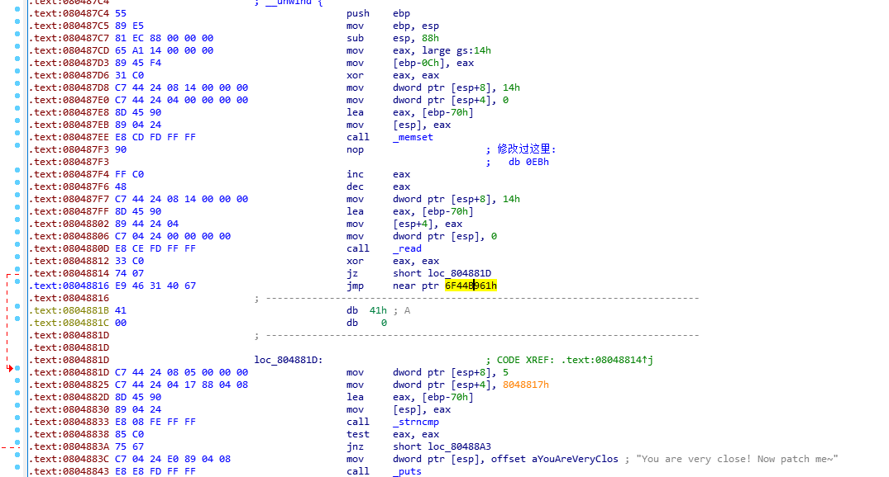
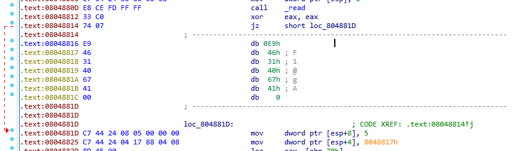
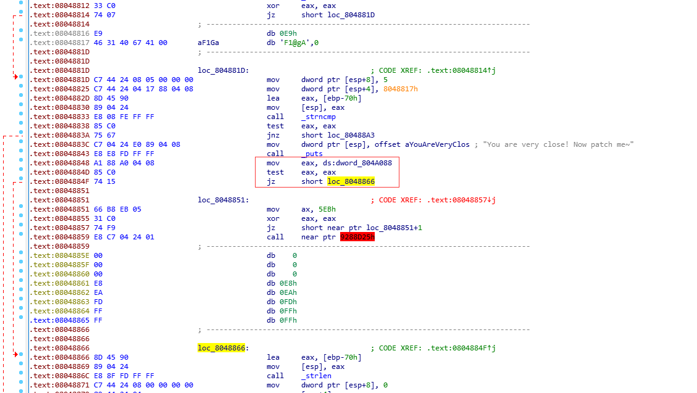
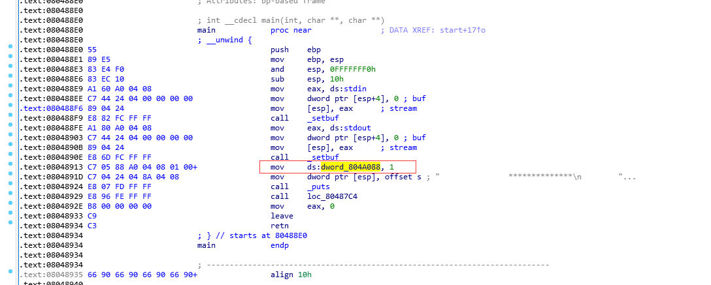
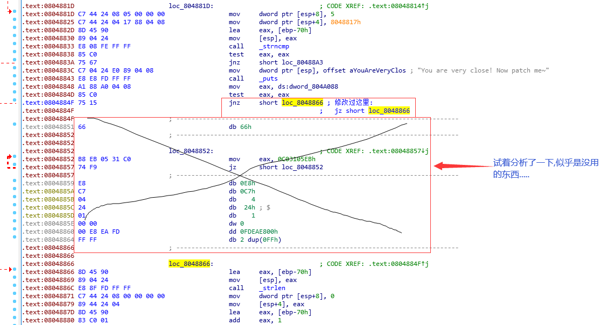
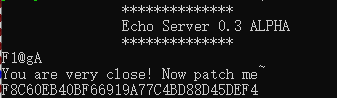

#### 先看 main 函数



#### 看看 loc_80487C1



#### 既然 IDA 无法分析出指令,那就转为数据(这里使用了两次转为数据)



#### 这个 db 0E8h 可以查一下


#### 原来是花指令,为了之后的分析,把它改为 nop



#### 这个 db 0EBh 可以查一下


#### 和上面那个差不多,而且这里是 jmp 跳一个字节,不如直接把 EB 改成 90(nop), 转为数据 -> 改为 nop -> 转为代码



#### 这个 6F448961h 明显就不对,而且前面我们可以看到它

```asm
xor eax, eax
jz short loc_804881D
```

#### 先把 eax 置为 0 ,然后判断 eax 为 0 则跳转, 这其实就是 jmp 吧, 再加上我们可以在后面看到有个

```asm
mov dword ptr [esp+4], 8048817h
```

#### 那不就是引用这一段的内容么,所以我们可以把后面这一段转为数据



#### 哦,这应该是个好东西,转为字符串



#### 之后这里有个条件跳转,要看 dword_804A088 的数据,我们可以看看交叉引用



#### 只有这一处引用,直接把 dword_804A088 硬编码为 1 了,那么后面的跳转肯定不会实现了,我们可以把 jz 改为 jnz 或者直接暴力的 jmp



#### patch 到程序,然后执行看看,输入应该是那个字符串 F1@gA



#### 上面这张截图不是我的(因为我的虚拟机版本太新了(试过了Ubuntu/Kali/CentOS, libcrypto.so只有1.0.2,题目要求1.0.0,试过了无数种方法依旧没用....))