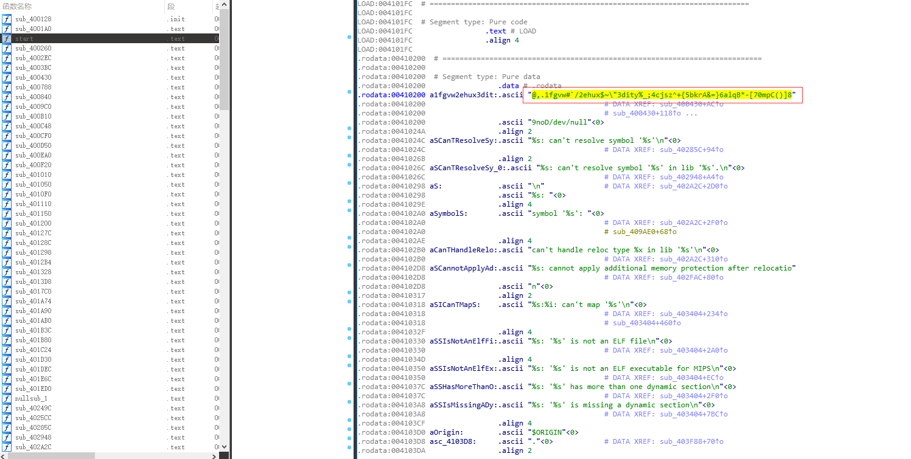
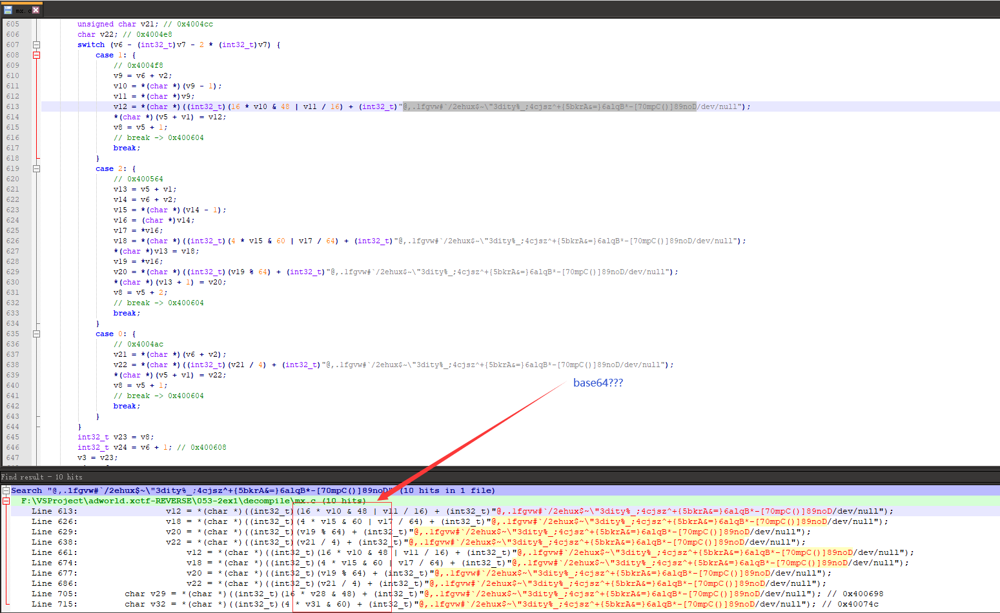

#### 又是 MIPS,看不懂,看看字符串

#### [试试新的黑科技](https://github.com/avast/retdec)

##### PS D:\retdec-v4.0-windows-32b\retdec\bin> python .\retdec-decompiler.py F:\VSProject\adworld.xctf-REVERSE\053-2ex1\mx  (这个MIPS程序是32位的)

#### 猜测是base64