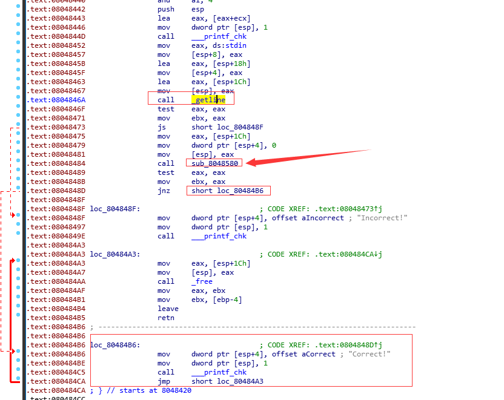
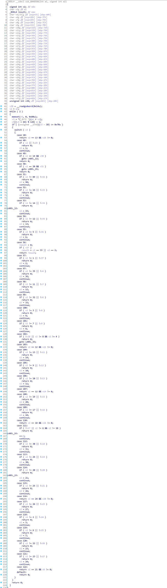
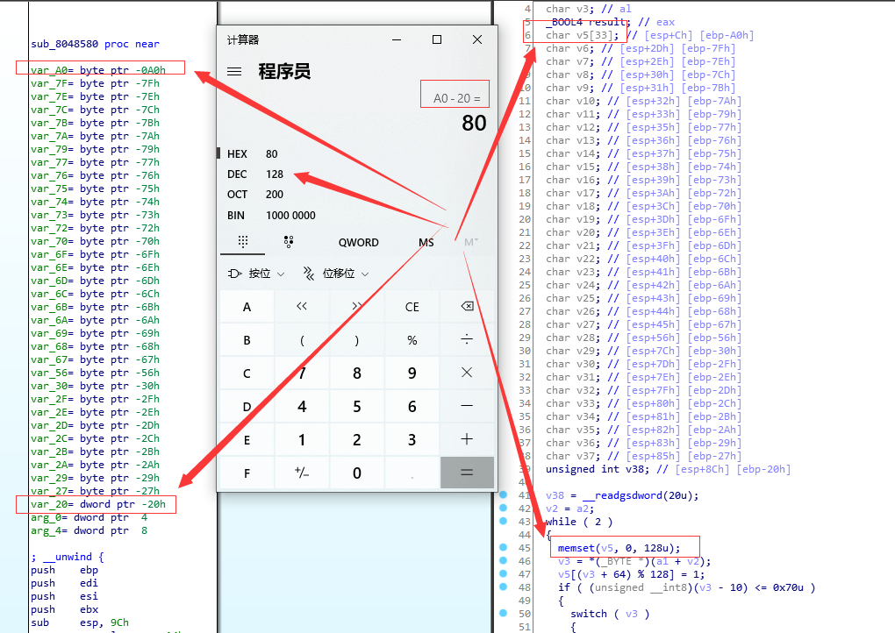
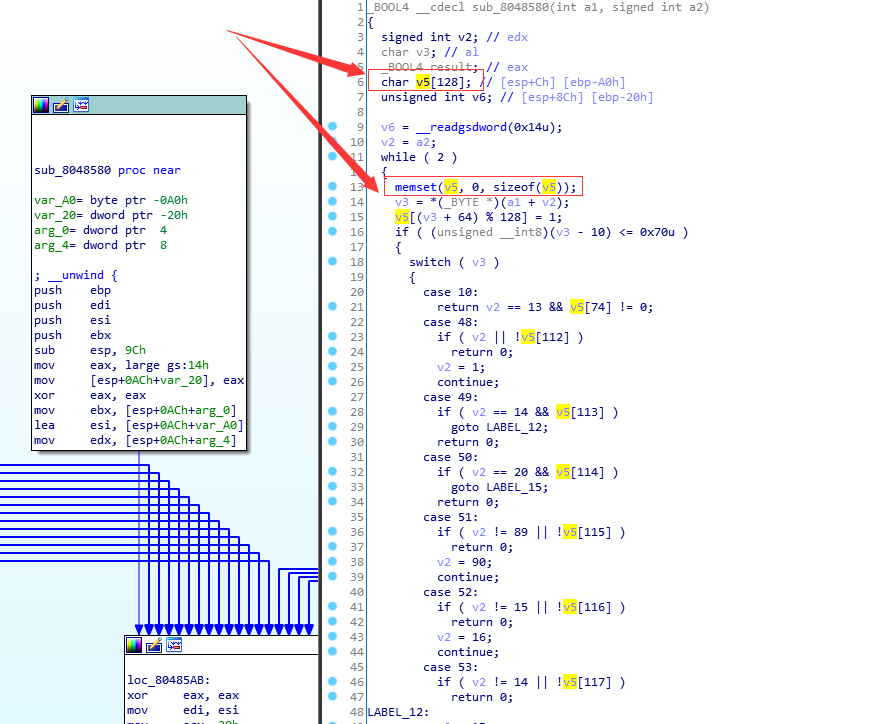
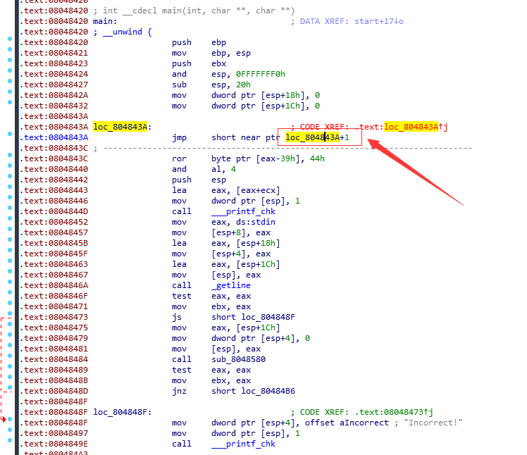
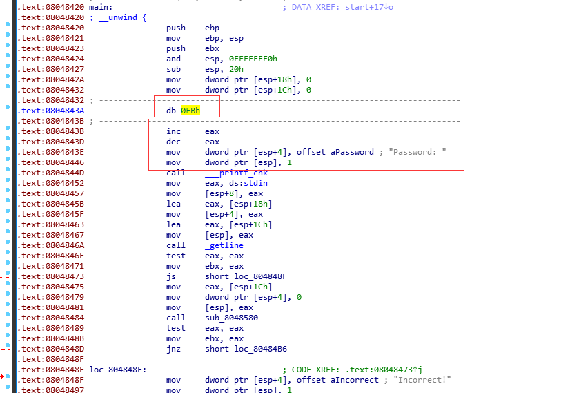
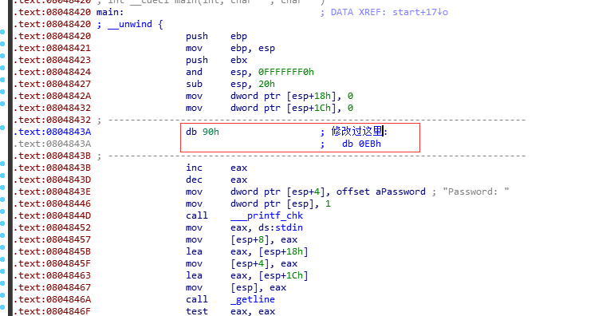
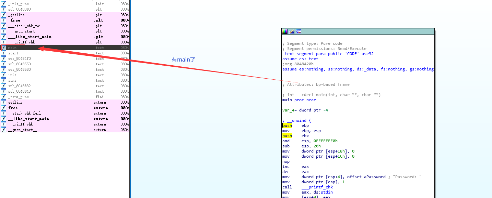
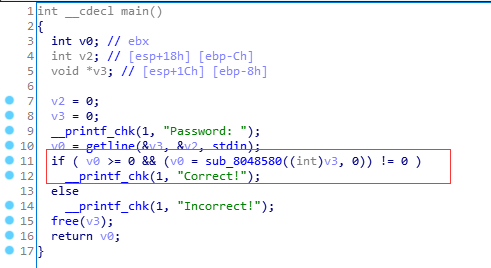
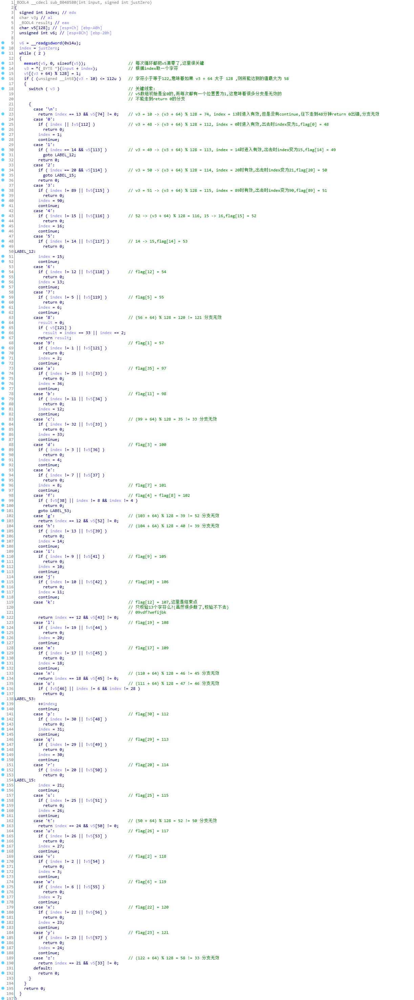

#### 先看 main 汇编代码(这里也没注意为啥不能转为函数然后获得伪代码)

#### 看看主要判断函数

#### 看到像v5这种char数组后面接了一堆char的就知道没识别完全

#### 改一下v5的类型

#### 好了,逻辑有了,但是参数怎么办,两个参数一个是输入,那另一个呢?

#### 可以看到 08048479 是参数 0,不过管他呢,我们发现了一个坏东西,一个花指令,使用 DC 组合拳(转为数据,转为代码)

#### 又是你! db 0EBh,直接nop掉

#### patch文件,然后重新打开这个东西

#### 发现多了个 main 函数,虽然有没有无所谓...

#### 然后继续分析之前的主逻辑函数

#### 到这里就分析完了