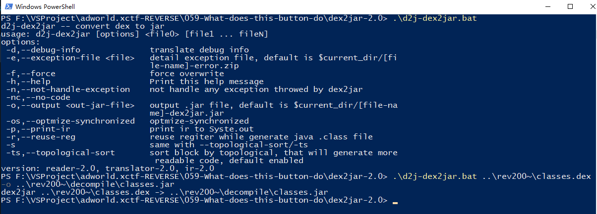
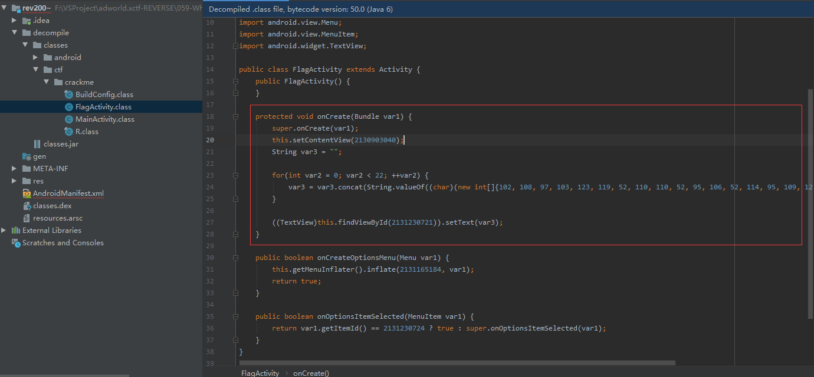
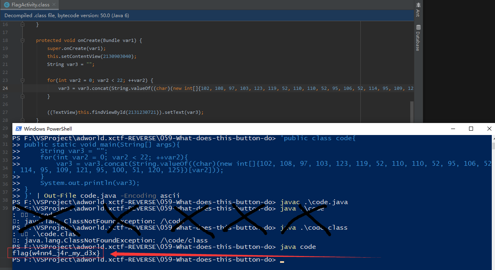

#### 给了一个 zip 压缩包(我改名为了What-does-this-button-do.zip)

#### 解压出了一个 rev200 文件,还是 zip 压缩包

#### 解压出了 rev200~ ,好的是安卓.但是为什么没有 class 文件?

#### 搜索 dex 文件,懂了. [去这里](https://github.com/pxb1988/dex2jar)下个反编译程序

#### 下载了个 dex2jar-2.0.zip ,解压出个 dex2jar-2.0

#### 在 F:\VSProject\adworld.xctf-REVERSE\059-What-does-this-button-do\rev200~\decompile 这里我们有了一个 classes.jar

#### 再把 jar 解压出来得到 classes 文件夹,里面有我们想要的东西

#### 直接运行他的代码

#### 结束