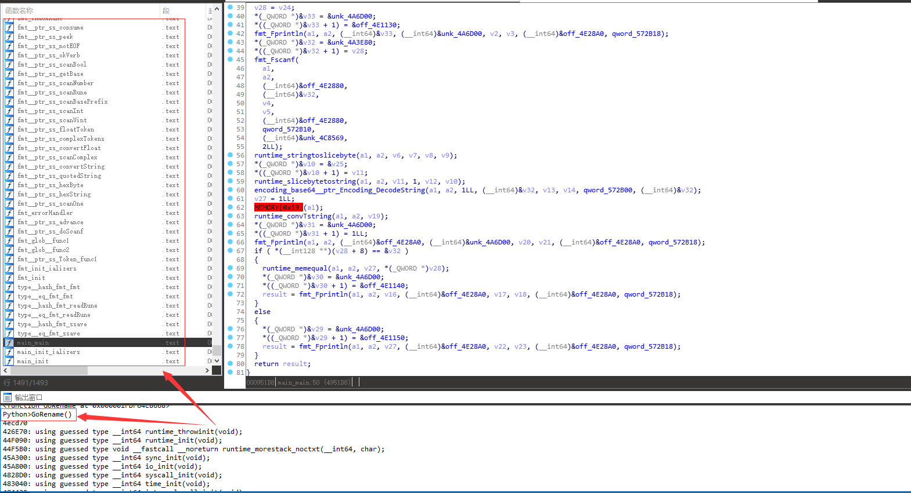
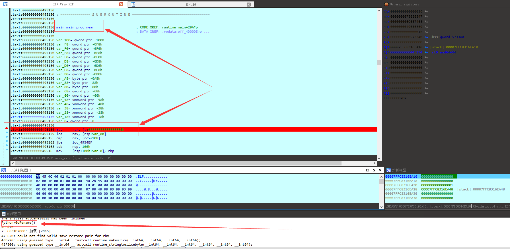
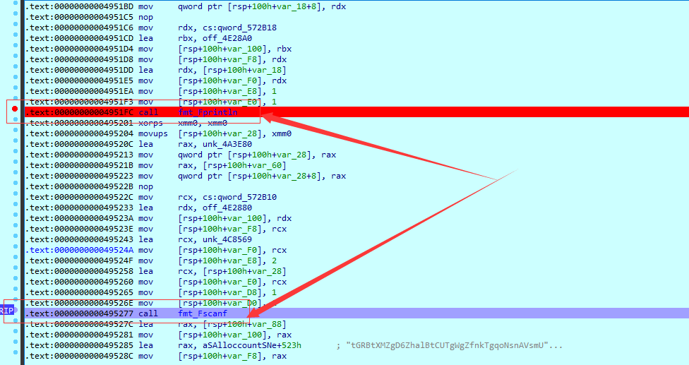
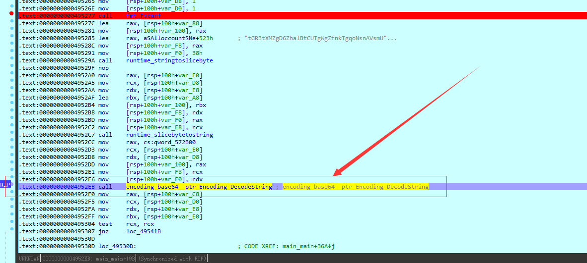
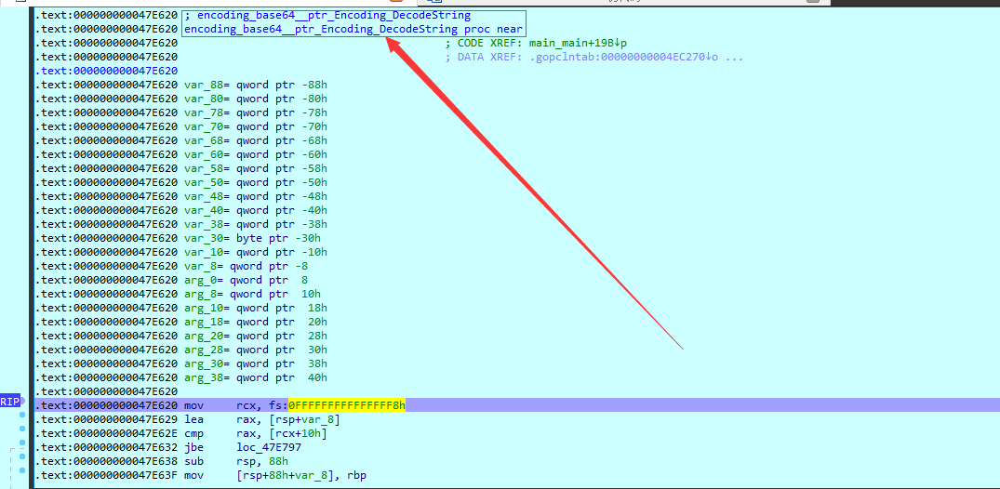
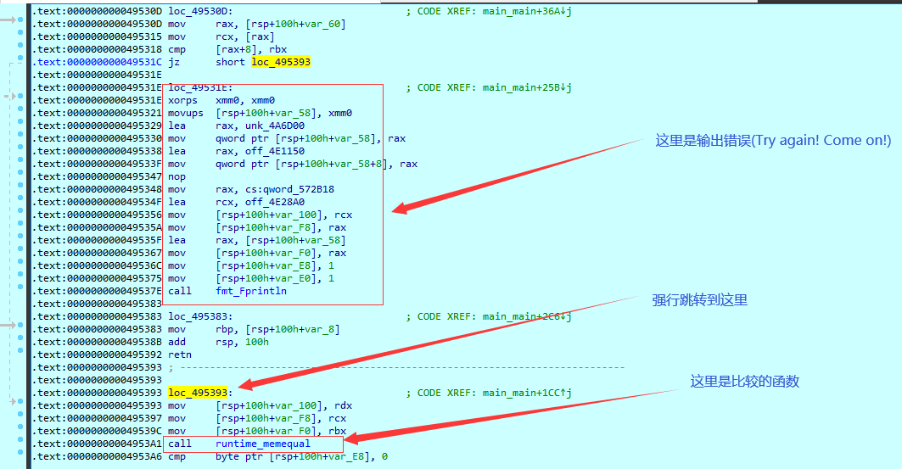
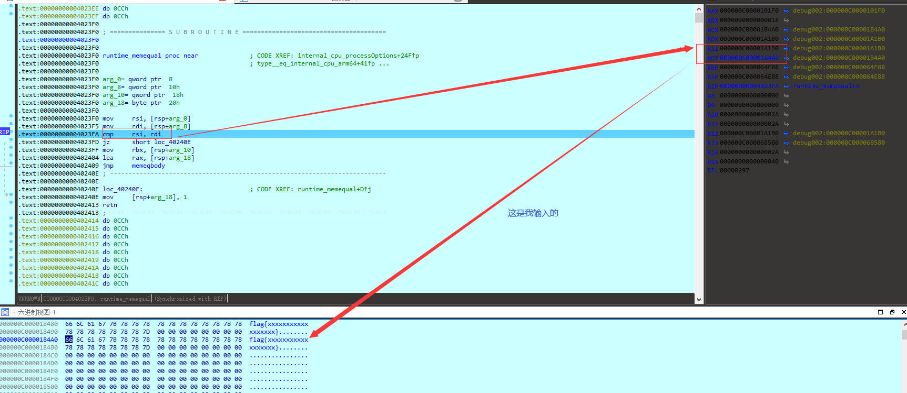
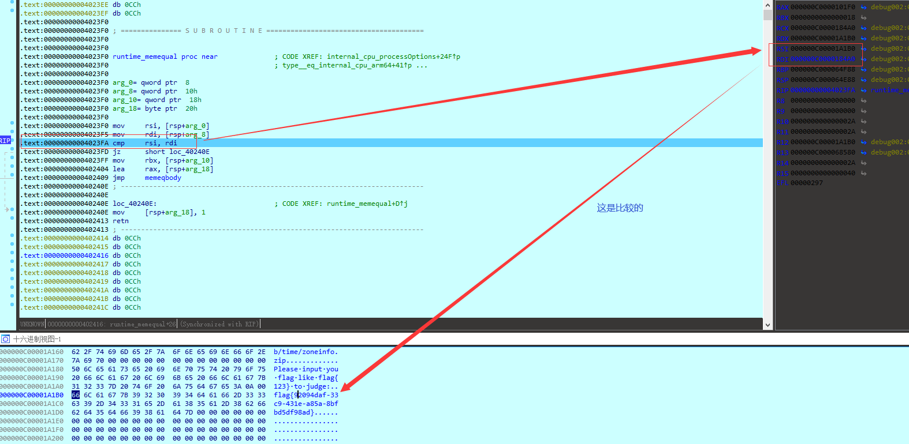

#### 没有 go 的符号表,[整一个](https://gitlab.com/zaytsevgu/goutils/blob/master/go_renamer.py)(见同目录go_renamer.py)

#### 有到是有了主函数,不过函数太多了看的眼花(而且好像还有点问题),动态调试了

#### 断在了 main 函数,往下走

#### 发现了输出和输入,下面的 fmt_Fscanf 就是获取我们输入的值

#### 在获取输入的下面还有个 base64 的函数,估计这就是主要的判断函数了

#### 跟进函数,然后慢慢走

#### 发现了我们需要的分支,在 text:000000000049531C 的那个 jz 那里强行跳到 loc_495393 ,因为这个 runtime_memequal 可能就是比较flag的函数(这个判断好像是判断输入的长度对不对)

#### 然后就拿到了我们需要的 flag 了...