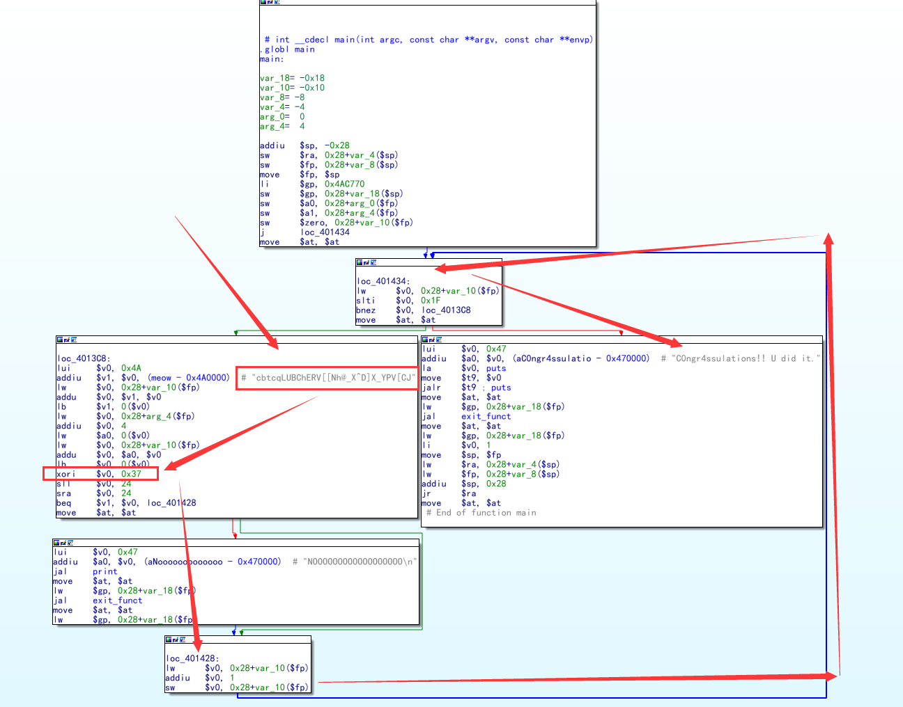
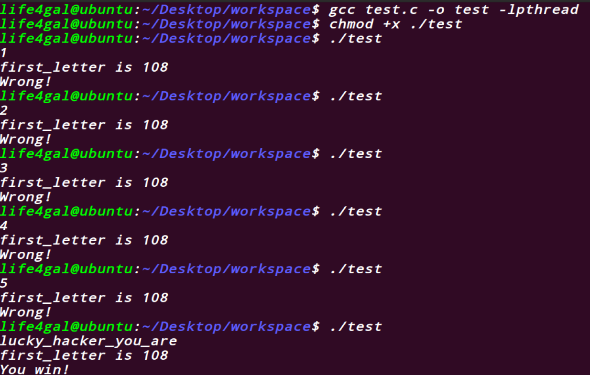
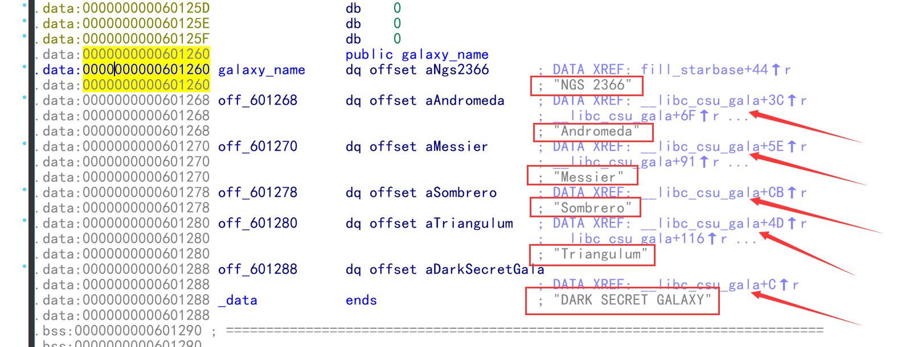
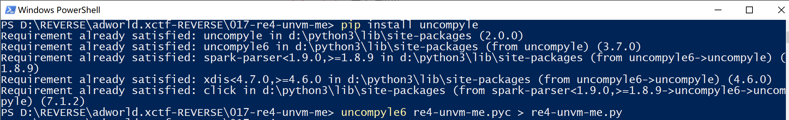
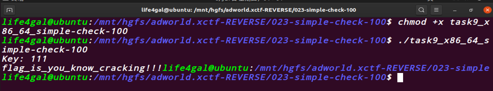
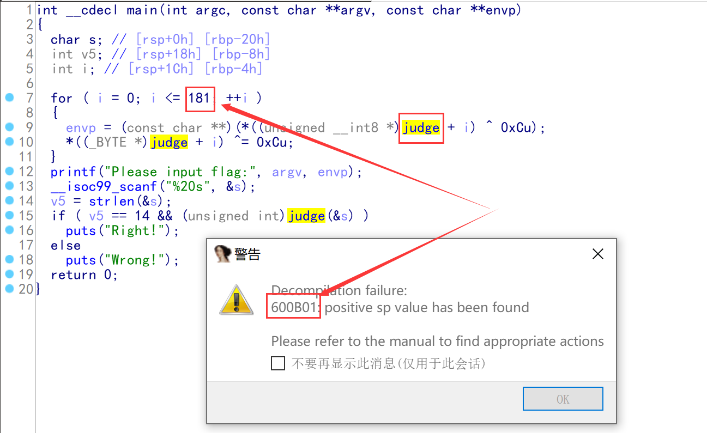
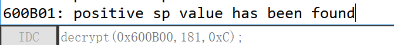
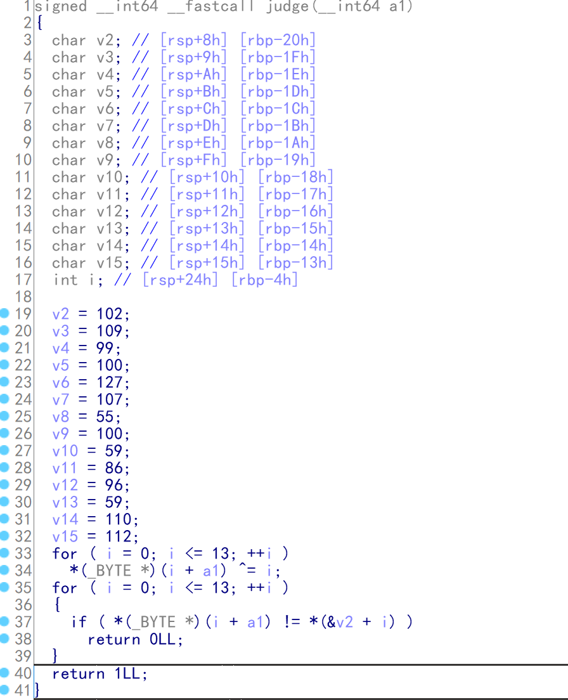
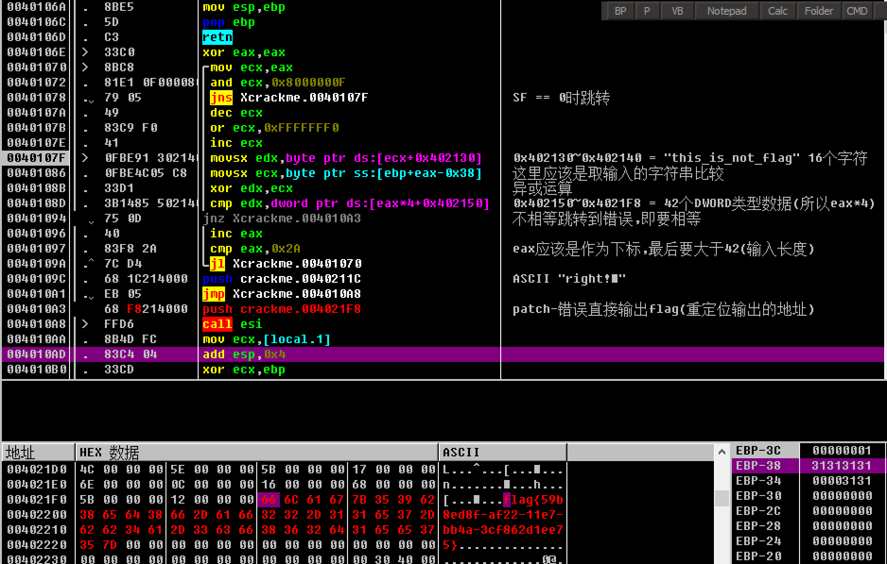

# [攻防世界](https://adworld.xctf.org.cn/)逆向题

#### 第一题: hackme

​	难度系数: 2.0(好像2020-8-7左右变成了3.0)

​	题目来源: XCTF 3rd-GCTF-2017

​	用时: 26分18秒

​	原题链接:[传送门](https://adworld.xctf.org.cn/task/answer?type=reverse&number=4&grade=1&id=4881&page=1)

#### 第二题: Guess-the-Number

​	难度系数: 2.0(不知道啥时候变成了3.0, 2020-8-15左右?)(2020-8-20难度变回2.0)

​	题目来源: su-ctf-quals-2014

​	用时: 17分1秒

​	原题链接:[传送门](https://adworld.xctf.org.cn/task/answer?type=reverse&number=4&grade=1&id=4908&page=1)

​	吐槽: 居然给我一个 jar 包,我蒙了...突然不知道干嘛了,鬼使神差的打开了 IDA 看的一脸蒙蔽,突然想起自己装了个 IDEA (只多了个E),把jar包里的class文件反编译一下代码就出来了....

#### 第三题: re2-cpp-is-awesome

​	难度系数: 2.0

​	题目来源: alexctf-2017

​	用时: 34分46秒

​	原题链接:[传送门](https://adworld.xctf.org.cn/task/answer?type=reverse&number=4&grade=1&id=5031&page=1)

​	吐槽: 一眼看过去全是 std: :__ cxx11: :basic_string<char, std: :char_ traits<char>, std: :allocator<char>>, 我都要吐了.....

#### 第四题: 666

​	难度系数: 2.0

​	题目来源: 2019_UNCTF

​	用时: 18分17秒

​	原题链接: [传送门](https://adworld.xctf.org.cn/task/answer?type=reverse&number=4&grade=1&id=5573&page=1)

​	吐槽: 终于见一次反汇编出来的代码这么少的了...

#### 第五题: easyRE1

​	难度系数: 2.0

​	题目来源: 无

​	用时: 14分58秒

​	原题链接: [传送门](https://adworld.xctf.org.cn/task/answer?type=reverse&number=4&grade=1&id=5592&page=1)

​	吐槽: 屎一样的原创题目, 花了三分钟得到答案 **FLAG:db2f62a36a018bce28e46d976e3f9864**,高高兴兴地填了上去,**答案错误**. 我: ??? 什么鬼,就那么几条破代码,怎么藏答案?绞尽脑汁想了半天放弃了,查看 WP 发现我的过程完全正确,但是填入的格式是**flag{db2f62a36a018bce28e46d976e3f9864}**. 我: ??? 拜托,不要再出这种题目了OK?

#### 第六题: re1-100

​	难度系数: 2.0

​	题目来源: 无

​	用时: 35分30秒

​	原题链接: [传送门](https://adworld.xctf.org.cn/task/answer?type=reverse&number=4&grade=1&id=4720&page=1)

​	吐槽: 忍不住爆粗口,原创题真是恶心死我了,上一题是把**FLAG:db2f62a36a018bce28e46d976e3f9864** 换成 **flag{db2f62a36a018bce28e46d976e3f9864}**,这次是把**{53fc275d81053ed5be8cdaf29f59034938ae4efd}**换成**53fc275d81053ed5be8cdaf29f59034938ae4efd**(去掉花括号),我又多花了20分钟然后放弃了看 WP ,关键是官方WP也是屎一样,要不是别人的WP说了句记得把花括号去掉我估计永远都对不了,真的***...

#### 第七题: Shuffle

​	难度系数: 2.0

​	题目来源: SECCON-CTF-2014

​	用时:  11分45秒

​	原题链接: [传送门](https://adworld.xctf.org.cn/task/answer?type=reverse&number=4&grade=1&id=4942&page=1)

​	吐槽: 下载的文件被谷歌浏览器拦截,搞得我浪费很多时间,丢人!

#### 第八题: re-for-50-plz-50

​	难度系数: 2.0

​	题目来源: tu-ctf-2016

​	用时: 12分24秒

​	原题链接: [传送门](https://adworld.xctf.org.cn/task/answer?type=reverse&number=4&grade=1&id=4952&page=1)

​	吐槽: 完全看不懂的汇编代码,虚拟机执行不了(不是可执行的二进制文件),IDA不能把它反编译(不是可反编译的文件),挣扎了10分钟放弃了.WP也是一坨屎,直接说该怎么整的,吐了...(附截图)



​	追加吐槽: 上面的代码是 **mips架构(Microprocessor without Interlocked Pipeline Stages)**,虽然题目我放弃了,但是解题方法还是要留下的.Retdec的IDA插件: [1.看雪论坛](https://bbs.pediy.com/thread-227079-1.htm)   [2.Gayhub](https://github.com/avast/retdec-idaplugin)

#### 第九题: dmd-50

​	难度系数: 2.0

​	题目来源: suctf-2016

​	用时: 20分50秒

​	原题链接: [传送门](https://adworld.xctf.org.cn/task/answer?type=reverse&number=4&grade=1&id=4959&page=1)

​	吐槽: 第一眼看到 MD5 我其实是拒绝的,因为你不能让我算 MD5 我就去算.但是不算题目又做不出来,所以我只好乖乖去算了. [十分钟后....] WTF,我是笨蛋吗?不是有 MD5 在线加/解密的网站吗?我为什么要自己算????????????????

#### 第十题: parallel-comparator-200

​	难度系数: 2.0

​	题目来源: school-ctf-winter-2015

​	用时: 24分25秒

​	原题链接: [传送门](https://adworld.xctf.org.cn/task/answer?type=reverse&number=4&grade=1&id=4706&page=1)

​	吐槽: 刚开始看到随机数的时候我有点懵逼,毕竟这是不可控因素.但是我发现它没有指定任何参数,那么就有可能是伪随机.我们把代码搬到linux虚拟机上



由于有源代码,我们可以很容易得到结果.

#### 第十一题: secret-galaxy-300

​	难度系数: 2.0

​	题目来源: school-ctf-winter-2015

​	用时: 8分16秒

​	原题链接: [传送门](https://adworld.xctf.org.cn/task/answer?type=reverse&number=4&grade=1&id=4707&page=1)

​	吐槽: 好家伙,答案居然不在主逻辑里,还好我眼尖发现其他有地方的引用



#### 第十二题: srm-50

​	难度系数: 2.0

​	题目来源: suctf-2016

​	用时: 10分35秒

​	原题链接: [传送门](https://adworld.xctf.org.cn/task/answer?type=reverse&number=4&grade=1&id=4963&page=1)

#### 第十三题: Mysterious

​	难度系数: 2.0(2020-8-20难度变为1.0)

​	题目来源: BUUCTF-2019

​	用时: 11分18秒

​	原题链接: [传送门](https://adworld.xctf.org.cn/task/answer?type=reverse&number=4&grade=1&id=5480&page=1)

​	吐槽: 题目很简单,主要是和别人吐槽了很久.题目描述是[有一天，一个论坛老鸟给小明发了一个神秘的盒子，里面有开启逆向思维的秘密。],一看程序居然是百度的图标,好家伙,一点没骗我.....

#### 第十四题: answer_to_everything

​	难度系数: 2.0

​	题目来源: 2019_ISCC

​	用时: 5分43秒

​	原题链接: [传送门](https://adworld.xctf.org.cn/task/answer?type=reverse&number=4&grade=1&id=5511&page=1)

​	吐槽: 啊哈,我知道了是42,但是这个答案的问题是什么呢?

#### 第十五题: elrond32

​	难度系数: 2.0

​	题目来源: tinyctf-2014

​	用时: 14分4秒

​	原题链接: [传送门](https://adworld.xctf.org.cn/task/answer?type=reverse&number=4&grade=1&id=4750&page=1)

#### 	第十六题: tt3441810

​	难度系数: 2.0

​	题目来源: tinyctf-2014

​	用时: 4分57秒

​	原题链接: [传送门](https://adworld.xctf.org.cn/task/answer?type=reverse&number=4&grade=1&id=4751&page=1)

#### 第十七题: re4-unvm-me

​	难度系数: 2.0

​	题目来源: alexctf-2017

​	用时: 15分44秒

​	原题链接: [传送门](https://adworld.xctf.org.cn/task/answer?type=reverse&number=4&grade=1&id=5033&page=1)

​	吐槽: 欺负我不会 python ? (编码用的 UTF-16, 用 IDLE 打不开, 用 np++ 打开才知道)



#### 第十八题: Reversing-x64Elf-100

​	难度系数: 1.0

​	题目来源: 无

​	用时: 8分28秒

​	原题链接: [传送门](https://adworld.xctf.org.cn/task/answer?type=reverse&number=4&grade=1&id=4826&page=1)

#### 第十九题: IgniteMe

​	难度系数: 1.0

​	题目来源: 高校网络信息安全运维挑战赛

​	用时: 21分30秒

​	原题链接: [传送门](https://adworld.xctf.org.cn/task/answer?type=reverse&number=4&grade=1&id=4590&page=1)

#### 第二十题: 流浪者

​	难度系数: 2.0

​	题目来源: 无

​	用时: 32分34秒

​	原题链接: [传送门](https://adworld.xctf.org.cn/task/answer?type=reverse&number=4&grade=1&id=5570&page=1)

​	吐槽: 主函数分析倒是不难,找主函数花点时间...

#### 第二十一题: EasyRE

​	难度系数: 2.0

​	题目来源: 无

​	用时: 21分55秒

​	原题链接: [传送门](https://adworld.xctf.org.cn/task/answer?type=reverse&number=4&grade=1&id=5446&page=1)

#### 第二十二题: SignIn

​	难度系数: 2.0

​	题目来源: 2019_SUCTF

​	用时: 18分50秒

​	原题链接: [传送门](https://adworld.xctf.org.cn/task/answer?type=reverse&number=4&grade=1&id=5583&page=2)

​	吐槽: 这道题不应该放在 [逆向] 栏中,应该放在 [PWN] 栏,毕竟flag也是**suctf{Pwn_@_hundred_years}**.内容大概是用几个函数进行了 **RSA** 加密,部分属于我的知识盲区(我承认我当时偷懒了...下次还偷懒) ....

#### 第二十三题: simple-check-100

​	难度系数: 2.0

​	题目来源: school-ctf-winter-2015

​	用时: 27分16秒

​	原题链接: [传送门](https://adworld.xctf.org.cn/task/answer?type=reverse&number=4&grade=1&id=4709&page=1)

​	吐槽: 可恶啊,OD 调试一遍, patch 一下程序,结果 windows 输出是乱码, 又用 IDA 调试了一遍,到虚拟机上跑就可以了...



#### 第二十四题: debug

​	难度系数: 3.0

​	题目来源: XCTF 3rd-GCTF-2017

​	用时: 9分22秒

​	原题链接: [传送门](https://adworld.xctf.org.cn/task/answer?type=reverse&number=4&grade=1&id=4880&page=2)

​	吐槽: 可恶,什么时候我在电脑上装了个 dnSpy ???

#### 第二十五题: BABYRE

​	难度系数: 3.0

​	题目来源: XCTF 4th-WHCTF-2017

​	用时: 38分10秒

​	原题链接: [传送门](https://adworld.xctf.org.cn/task/answer?type=reverse&number=4&grade=1&id=4662&page=2)

​	吐槽: 欺负我不会 gdb 调试?程序对主函数进行了加密,导致静态调试有一些麻烦,但是 IDA 大法好!!!!!!!!(破音)



```c++
// 见 025-BABYRE/patch.idc
#include<idc.idc>
static decrypt(from,size,key){
    auto i,x;
    for(i=0;i<=size;i++){
        x = Byte(from);
        x = (x^key);
        PatchByte(from,x);
        from = from + 1;
    }
}
```





#### 第二十六题: EASYHOOK

​	难度系数: 3.0

​	题目来源: XCTF 4th-WHCTF-2017

​	用时: 18分48秒

​	原题链接: [传送门](https://adworld.xctf.org.cn/task/answer?type=reverse&number=4&grade=1&id=4664&page=2)

#### 第二十七题: crackme

​	难度系数: 3.0

​	题目来源: SHCTF-2017

​	用时: 33分31秒

​	原题链接: [传送门](https://adworld.xctf.org.cn/task/answer?type=reverse&number=4&grade=1&id=4966&page=2)

​	吐槽: 加了个壳, **nSPack 3.7 -> North Star/Liu Xing Ping**,这可出大事了,我不会脱壳...那没办法咯,只能下断点慢慢找,功夫不负有心人,还真给我找着了.不过由于没有脱壳,每次运行程序地址都会变化(所以上次下的断下次运行就不对了),所以没有patch程序...



#### 第二十八题: crazy

​	难度系数: 3.0

​	题目来源: 百越杯2018

​	用时: 25分23秒

​	原题链接: [传送门](https://adworld.xctf.org.cn/task/answer?type=reverse&number=4&grade=1&id=5509&page=3)

​	吐槽: 这下谁都知道你玩 **星际争霸(Star Craft)** 了...(看C艹的题目真的好伤眼睛...)

​	追加吐槽: HighTemplar == 高阶圣堂武士 == 闪电, DarkTemplar == 黑暗圣堂武士 == 影刀

#### 第二十九题: Replace

​	难度系数: 2.0

​	题目来源: 湖湘杯2018

​	用时: 21分25秒

​	原题链接: [传送门](https://adworld.xctf.org.cn/task/answer?type=reverse&number=4&grade=1&id=5565&page=1)

#### 第三十题: gametime

​	难度系数: 3.0

​	题目来源: csaw-ctf-2016-quals

​	用时: 22分57秒

​	原题链接: [传送门](https://adworld.xctf.org.cn/task/answer?type=reverse&number=4&grade=1&id=5005&page=3)

​	吐槽: 一顿分析猛如虎,结果还不是暴力跳转....

#### 第三十一题: ReverseMe-120

​	难度系数: 2.0

​	题目来源: 无

​	用时: 27分24秒

​	原题链接: [传送门](https://adworld.xctf.org.cn/task/answer?type=reverse&number=4&grade=1&id=4825&page=2)

#### 第三十二题: serial-150

​	难度系数: 3.0

​	题目来源: suctf-2016

​	用时: 35分21秒

​	原题链接: [传送门](https://adworld.xctf.org.cn/task/answer?type=reverse&number=4&grade=1&id=4962&page=2)

​	吐槽: 应该算第一次用IDA远程调试吧,虽然不如OD顺手,但是谁叫我不会GDB呢:disappointed:

#### 第三十三题: secret-string-400

​	难度系数: 3.0

​	题目来源: school-ctf-winter-2015

​	用时: 36分31秒

​	原题链接: [传送门](https://adworld.xctf.org.cn/task/answer?type=reverse&number=4&grade=1&id=4708&page=2)

​	吐槽: 你们管这叫逆向?好家伙,我直接现学了一遍 JavaScript...

#### 第三十四题: testre

​	难度系数: 3.0

​	题目来源: 2019_西湖论剑_预选赛

​	用时: 43分9秒

​	原题链接: [传送门](https://adworld.xctf.org.cn/task/answer?type=reverse&number=4&grade=1&id=5476&page=2)

​	吐槽: fxxk!!!(发出了喜欢base加密的声音)


