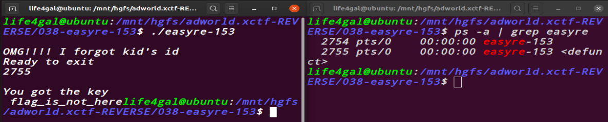

# [攻防世界](https://adworld.xctf.org.cn/)逆向题

#### 第一题: hackme

​	难度系数: 2.0(好像2020-8-7左右变成了3.0)

​	题目来源: XCTF 3rd-GCTF-2017

​	用时: 26分18秒

​	原题链接:[传送门](https://adworld.xctf.org.cn/task/answer?type=reverse&number=4&grade=1&id=4881&page=1)

#### 第二题: Guess-the-Number

​	难度系数: 2.0(不知道啥时候变成了3.0, 2020-8-15左右?)(2020-8-20难度变回2.0)

​	题目来源: su-ctf-quals-2014

​	用时: 17分1秒

​	原题链接:[传送门](https://adworld.xctf.org.cn/task/answer?type=reverse&number=4&grade=1&id=4908&page=1)

​	吐槽: 居然给我一个 jar 包,我蒙了...突然不知道干嘛了,鬼使神差的打开了 IDA 看的一脸蒙蔽,突然想起自己装了个 IDEA (只多了个E),把jar包里的class文件反编译一下代码就出来了....

#### 第三题: re2-cpp-is-awesome

​	难度系数: 2.0

​	题目来源: alexctf-2017

​	用时: 34分46秒

​	原题链接:[传送门](https://adworld.xctf.org.cn/task/answer?type=reverse&number=4&grade=1&id=5031&page=1)

​	吐槽: 一眼看过去全是 std: :__ cxx11: :basic_string<char, std: :char_ traits<char>, std: :allocator<char>>, 我都要吐了.....

#### 第四题: 666

​	难度系数: 2.0

​	题目来源: 2019_UNCTF

​	用时: 18分17秒

​	原题链接: [传送门](https://adworld.xctf.org.cn/task/answer?type=reverse&number=4&grade=1&id=5573&page=1)

​	吐槽: 终于见一次反汇编出来的代码这么少的了...

#### 第五题: easyRE1

​	难度系数: 2.0

​	题目来源: 无

​	用时: 14分58秒

​	原题链接: [传送门](https://adworld.xctf.org.cn/task/answer?type=reverse&number=4&grade=1&id=5592&page=1)

​	吐槽: 屎一样的原创题目, 花了三分钟得到答案 **FLAG:db2f62a36a018bce28e46d976e3f9864**,高高兴兴地填了上去,**答案错误**. 我: ??? 什么鬼,就那么几条破代码,怎么藏答案?绞尽脑汁想了半天放弃了,查看 WP 发现我的过程完全正确,但是填入的格式是**flag{db2f62a36a018bce28e46d976e3f9864}**. 我: ??? 拜托,不要再出这种题目了OK?

#### 第六题: re1-100

​	难度系数: 2.0

​	题目来源: 无

​	用时: 35分30秒

​	原题链接: [传送门](https://adworld.xctf.org.cn/task/answer?type=reverse&number=4&grade=1&id=4720&page=1)

​	吐槽: 忍不住爆粗口,原创题真是恶心死我了,上一题是把**FLAG:db2f62a36a018bce28e46d976e3f9864** 换成 **flag{db2f62a36a018bce28e46d976e3f9864}**,这次是把**{53fc275d81053ed5be8cdaf29f59034938ae4efd}**换成**53fc275d81053ed5be8cdaf29f59034938ae4efd**(去掉花括号),我又多花了20分钟然后放弃了看 WP ,关键是官方WP也是屎一样,要不是别人的WP说了句记得把花括号去掉我估计永远都对不了,真的***...

#### 第七题: Shuffle

​	难度系数: 2.0

​	题目来源: SECCON-CTF-2014

​	用时:  11分45秒

​	原题链接: [传送门](https://adworld.xctf.org.cn/task/answer?type=reverse&number=4&grade=1&id=4942&page=1)

​	吐槽: 下载的文件被谷歌浏览器拦截,搞得我浪费很多时间,丢人!

#### 第八题: re-for-50-plz-50

​	难度系数: 2.0

​	题目来源: tu-ctf-2016

​	用时: 12分24秒

​	原题链接: [传送门](https://adworld.xctf.org.cn/task/answer?type=reverse&number=4&grade=1&id=4952&page=1)

​	吐槽: 完全看不懂的汇编代码,虚拟机执行不了(不是可执行的二进制文件),IDA不能把它反编译(不是可反编译的文件),挣扎了10分钟放弃了.WP也是一坨屎,直接说该怎么整的,吐了...(附截图)


​	追加吐槽: 上面的代码是 **mips架构(Microprocessor without Interlocked Pipeline Stages)**,虽然题目我放弃了,但是解题方法还是要留下的.Retdec的IDA插件: [1.看雪论坛](https://bbs.pediy.com/thread-227079-1.htm)   [2.Gayhub](https://github.com/avast/retdec-idaplugin)

#### 第九题: dmd-50

​	难度系数: 2.0

​	题目来源: suctf-2016

​	用时: 20分50秒

​	原题链接: [传送门](https://adworld.xctf.org.cn/task/answer?type=reverse&number=4&grade=1&id=4959&page=1)

​	吐槽: 第一眼看到 MD5 我其实是拒绝的,因为你不能让我算 MD5 我就去算.但是不算题目又做不出来,所以我只好乖乖去算了. [十分钟后....] WTF,我是笨蛋吗?不是有 MD5 在线加/解密的网站吗?我为什么要自己算????????????????

#### 第十题: parallel-comparator-200

​	难度系数: 2.0

​	题目来源: school-ctf-winter-2015

​	用时: 24分25秒

​	原题链接: [传送门](https://adworld.xctf.org.cn/task/answer?type=reverse&number=4&grade=1&id=4706&page=1)

​	吐槽: 刚开始看到随机数的时候我有点懵逼,毕竟这是不可控因素.但是我发现它没有指定任何参数,那么就有可能是伪随机.我们把代码搬到linux虚拟机上


由于有源代码,我们可以很容易得到结果.

#### 第十一题: secret-galaxy-300

​	难度系数: 2.0

​	题目来源: school-ctf-winter-2015

​	用时: 8分16秒

​	原题链接: [传送门](https://adworld.xctf.org.cn/task/answer?type=reverse&number=4&grade=1&id=4707&page=1)

​	吐槽: 好家伙,答案居然不在主逻辑里,还好我眼尖发现其他有地方的引用


#### 第十二题: srm-50

​	难度系数: 2.0

​	题目来源: suctf-2016

​	用时: 10分35秒

​	原题链接: [传送门](https://adworld.xctf.org.cn/task/answer?type=reverse&number=4&grade=1&id=4963&page=1)

#### 第十三题: Mysterious

​	难度系数: 2.0(2020-8-20难度变为1.0)

​	题目来源: BUUCTF-2019

​	用时: 11分18秒

​	原题链接: [传送门](https://adworld.xctf.org.cn/task/answer?type=reverse&number=4&grade=1&id=5480&page=1)

​	吐槽: 题目很简单,主要是和别人吐槽了很久.题目描述是[有一天，一个论坛老鸟给小明发了一个神秘的盒子，里面有开启逆向思维的秘密。],一看程序居然是百度的图标,好家伙,一点没骗我.....

#### 第十四题: answer_to_everything

​	难度系数: 2.0

​	题目来源: 2019_ISCC

​	用时: 5分43秒

​	原题链接: [传送门](https://adworld.xctf.org.cn/task/answer?type=reverse&number=4&grade=1&id=5511&page=1)

​	吐槽: 啊哈,我知道了是42,但是这个答案的问题是什么呢?

#### 第十五题: elrond32

​	难度系数: 2.0

​	题目来源: tinyctf-2014

​	用时: 14分4秒

​	原题链接: [传送门](https://adworld.xctf.org.cn/task/answer?type=reverse&number=4&grade=1&id=4750&page=1)

#### 	第十六题: tt3441810

​	难度系数: 2.0

​	题目来源: tinyctf-2014

​	用时: 4分57秒

​	原题链接: [传送门](https://adworld.xctf.org.cn/task/answer?type=reverse&number=4&grade=1&id=4751&page=1)

#### 第十七题: re4-unvm-me

​	难度系数: 2.0

​	题目来源: alexctf-2017

​	用时: 15分44秒

​	原题链接: [传送门](https://adworld.xctf.org.cn/task/answer?type=reverse&number=4&grade=1&id=5033&page=1)

​	吐槽: 欺负我不会 python ? (编码用的 UTF-16, 用 IDLE 打不开, 用 np++ 打开才知道)


#### 第十八题: Reversing-x64Elf-100

​	难度系数: 1.0

​	题目来源: 无

​	用时: 8分28秒

​	原题链接: [传送门](https://adworld.xctf.org.cn/task/answer?type=reverse&number=4&grade=1&id=4826&page=1)

#### 第十九题: IgniteMe

​	难度系数: 1.0

​	题目来源: 高校网络信息安全运维挑战赛

​	用时: 21分30秒

​	原题链接: [传送门](https://adworld.xctf.org.cn/task/answer?type=reverse&number=4&grade=1&id=4590&page=1)

#### 第二十题: 流浪者

​	难度系数: 2.0

​	题目来源: 无

​	用时: 32分34秒

​	原题链接: [传送门](https://adworld.xctf.org.cn/task/answer?type=reverse&number=4&grade=1&id=5570&page=1)

​	吐槽: 主函数分析倒是不难,找主函数花点时间...

#### 第二十一题: EasyRE

​	难度系数: 2.0

​	题目来源: 无

​	用时: 21分55秒

​	原题链接: [传送门](https://adworld.xctf.org.cn/task/answer?type=reverse&number=4&grade=1&id=5446&page=1)

#### 第二十二题: SignIn

​	难度系数: 2.0

​	题目来源: 2019_SUCTF

​	用时: 18分50秒

​	原题链接: [传送门](https://adworld.xctf.org.cn/task/answer?type=reverse&number=4&grade=1&id=5583&page=2)

​	吐槽: 这道题不应该放在 [逆向] 栏中,应该放在 [PWN] 栏,毕竟flag也是**suctf{Pwn_@_hundred_years}**.内容大概是用几个函数进行了 **RSA** 加密,部分属于我的知识盲区(我承认我当时偷懒了...下次还偷懒) ....

#### 第二十三题: simple-check-100

​	难度系数: 2.0

​	题目来源: school-ctf-winter-2015

​	用时: 27分16秒

​	原题链接: [传送门](https://adworld.xctf.org.cn/task/answer?type=reverse&number=4&grade=1&id=4709&page=1)

​	吐槽: 可恶啊,OD 调试一遍, patch 一下程序,结果 windows 输出是乱码, 又用 IDA 调试了一遍,到虚拟机上跑就可以了...


#### 第二十四题: debug

​	难度系数: 3.0

​	题目来源: XCTF 3rd-GCTF-2017

​	用时: 9分22秒

​	原题链接: [传送门](https://adworld.xctf.org.cn/task/answer?type=reverse&number=4&grade=1&id=4880&page=2)

​	吐槽: 可恶,什么时候我在电脑上装了个 dnSpy ???

#### 第二十五题: BABYRE

​	难度系数: 3.0

​	题目来源: XCTF 4th-WHCTF-2017

​	用时: 38分10秒

​	原题链接: [传送门](https://adworld.xctf.org.cn/task/answer?type=reverse&number=4&grade=1&id=4662&page=2)

​	吐槽: 欺负我不会 gdb 调试?程序对主函数进行了加密,导致静态调试有一些麻烦,但是 IDA 大法好!!!!!!!!(破音)


```c++
// 见 025-BABYRE/patch.idc
#include<idc.idc>
static decrypt(from,size,key){
    auto i,x;
    for(i=0;i<=size;i++){
        x = Byte(from);
        x = (x^key);
        PatchByte(from,x);
        from = from + 1;
    }
}
```


#### 第二十六题: EASYHOOK

​	难度系数: 3.0

​	题目来源: XCTF 4th-WHCTF-2017

​	用时: 18分48秒

​	原题链接: [传送门](https://adworld.xctf.org.cn/task/answer?type=reverse&number=4&grade=1&id=4664&page=2)

#### 第二十七题: crackme

​	难度系数: 3.0

​	题目来源: SHCTF-2017

​	用时: 33分31秒

​	原题链接: [传送门](https://adworld.xctf.org.cn/task/answer?type=reverse&number=4&grade=1&id=4966&page=2)

​	吐槽: 加了个壳, **nSPack 3.7 -> North Star/Liu Xing Ping**,这可出大事了,我不会脱壳...那没办法咯,只能下断点慢慢找,功夫不负有心人,还真给我找着了.不过由于没有脱壳,每次运行程序地址都会变化(所以上次下的断下次运行就不对了),所以没有patch程序...


#### 第二十八题: crazy

​	难度系数: 3.0

​	题目来源: 百越杯2018

​	用时: 25分23秒

​	原题链接: [传送门](https://adworld.xctf.org.cn/task/answer?type=reverse&number=4&grade=1&id=5509&page=3)

​	吐槽: 这下谁都知道你玩 **星际争霸(Star Craft)** 了...(看C艹的题目真的好伤眼睛...)

​	追加吐槽: HighTemplar == 高阶圣堂武士 == 闪电, DarkTemplar == 黑暗圣堂武士 == 影刀

#### 第二十九题: Replace

​	难度系数: 2.0

​	题目来源: 湖湘杯2018

​	用时: 21分25秒

​	原题链接: [传送门](https://adworld.xctf.org.cn/task/answer?type=reverse&number=4&grade=1&id=5565&page=1)

#### 第三十题: gametime

​	难度系数: 3.0

​	题目来源: csaw-ctf-2016-quals

​	用时: 22分57秒

​	原题链接: [传送门](https://adworld.xctf.org.cn/task/answer?type=reverse&number=4&grade=1&id=5005&page=3)

​	吐槽: 一顿分析猛如虎,结果还不是暴力跳转....

#### 第三十一题: ReverseMe-120

​	难度系数: 2.0

​	题目来源: 无

​	用时: 27分24秒

​	原题链接: [传送门](https://adworld.xctf.org.cn/task/answer?type=reverse&number=4&grade=1&id=4825&page=2)

#### 第三十二题: serial-150

​	难度系数: 3.0

​	题目来源: suctf-2016

​	用时: 35分21秒

​	原题链接: [传送门](https://adworld.xctf.org.cn/task/answer?type=reverse&number=4&grade=1&id=4962&page=2)

​	吐槽: 应该算第一次用IDA远程调试吧,虽然不如OD顺手,但是谁叫我不会GDB呢:disappointed:

#### 第三十三题: secret-string-400

​	难度系数: 3.0

​	题目来源: school-ctf-winter-2015

​	用时: 36分31秒

​	原题链接: [传送门](https://adworld.xctf.org.cn/task/answer?type=reverse&number=4&grade=1&id=4708&page=2)

​	吐槽: 你们管这叫逆向?好家伙,我直接现学了一遍 JavaScript...

#### 第三十四题: testre

​	难度系数: 3.0

​	题目来源: 2019_西湖论剑_预选赛

​	用时: 43分9秒

​	原题链接: [传送门](https://adworld.xctf.org.cn/task/answer?type=reverse&number=4&grade=1&id=5476&page=2)

​	吐槽: fxxk!!!(发出了喜欢base加密的声音)

#### 第三十五题: reverse-for-the-holy-grail-350

​	难度系数: 3.0

​	题目来源: tu-ctf-2016

​	用时: 37分1秒

​	原题链接: [传送门](https://adworld.xctf.org.cn/task/answer?type=reverse&number=4&grade=1&id=4953&page=2)

#### 第三十六题: Windows_Reverse2

​	难度系数: 3.0

​	题目来源: 2019_DDCTF

​	用时: 26分16秒

​	原题链接: [传送门](https://adworld.xctf.org.cn/task/answer?type=reverse&number=4&grade=1&id=5507&page=2)

​	吐槽: 加了 **ASPack 2.12** 压缩壳,解题用的脱壳机(见目录下的 **WASPACK.exe**, 脱壳后的程序为 **_UnPacked.exe**). 解完题后越想越气,难道我就真的不会脱壳嘛???然后用上了万能的**ESP定律(即执行完压缩的函数过程后栈最后总是要回归平衡的)**,在执行载入 OD 的第一个 PUSHAD 的下一条 CALL指令时,对 ESP 下一个硬件断点,然后执行程序,终于让我找到了传说中的 OEP!!!那让我高兴的,然后我开心的把它 Dump 出来,载入 IDA 发现有些数据被我丢掉了......然后就各种查方法,全部失败( ITA 是什么完全不懂),花费了几个小时才让我明白我真的不行...:disappointed::disappointed::disappointed:

#### 第三十七题: Newbie_calculations

​	难度系数: 3.0

​	题目来源: Hack-you-2014

​	用时: 50分7秒

​	原题链接: [传送门](https://adworld.xctf.org.cn/task/answer?type=reverse&number=4&grade=1&id=4973&page=2)

​	吐槽: 伪代码不可靠,有时候还是要看汇编代码...

```cpp
// 伪代码生成
signed int v4 = -1;
int v5 = -1 - a2 + 1; // a2是一个输入,好像一直是正数输入
while(v5)
{
    .....
    --v5;
}
// 这样的程序必定爆炸
// 但是如果是 
// 看汇编代码联想
unsigned int v4 = -1;
unsigned int v5 = v4 - a2 + 1;
// 结果一下就不一样了
```

#### 第三十八题: easyre-153

​	难度系数: 3.0

​	题目来源: XCTF 3rd-RCTF-2017

​	用时: 23分5秒

​	原题链接: [传送门](https://adworld.xctf.org.cn/task/answer?type=reverse&number=4&grade=1&id=4997&page=3)

​	吐槽: flag_is_not_here



#### 第三十九题: key

​	难度系数: 3.0

​	题目来源: csaw-ctf-2016-quals

​	用时: 47分26秒

​	原题链接: [传送门](https://adworld.xctf.org.cn/task/answer?type=reverse&number=4&grade=1&id=5006&page=3)

​	吐槽: 看c++头晕,动态调试大法好!

#### 第四十题: deedeedee

​	难度系数: 3.0

​	题目来源: csaw-ctf-2016-quals

​	用时: 2分45秒(实际未完成)

​	原题链接: [传送门](https://adworld.xctf.org.cn/task/answer?type=reverse&number=4&grade=1&id=5004&page=3)

​	吐槽: 程序是用[D语言](https://zh.wikipedia.org/wiki/D%E8%AA%9E%E8%A8%80)写的用时短是因为有给源码,本来是想过通过逆向的方式解题的,但是看了一眼函数我就放弃了,我还没见过这么多\*的参数(讲道理alias char[] string这个参数也不至于这么多\*呀....)......(生而为C艹程序员看不懂D语言,我很抱歉)


#### 第四十一题: Windows_Reverse1

​	难度系数: 3.0

​	题目来源: 2019_DDCTF

​	用时: 9分2秒

​	原题链接: [传送门](https://adworld.xctf.org.cn/task/answer?type=reverse&number=4&grade=1&id=5514&page=3)

​	吐槽: 加的 upx 壳,脱壳后动态调试 OD __无法正确分析程序__(直接打开程序也会闪退)(**官方的WP完全没有提到这个问题,我觉得这不应该只是我一个人的问题吧**),那没办法,只能 IDA 静态调试.但是静态调试是得不到结果的,但是


可以看到调用到的 byte_402FF8 附近有一个非常可疑的字符串,但是程序没有对它的引用.那没办法,只能赌一把了


加上 0x403018 -> 0x402ff8 的偏移,我们的结果至少变得合理了(事实证明也是对的),我想这个程序里赌的不止我一个人吧,它能跑起来想必也有赌的成分吧....

#### 第四十二题: notsequence

​	难度系数: 3.0

​	题目来源: RCTF-2015

​	用时: 28分11秒

​	原题链接: [传送门](https://adworld.xctf.org.cn/task/answer?type=reverse&number=4&grade=1&id=4772&page=3)

​	吐槽: 有数学基础应该就不用想那么久才想到是杨辉三角了...


​	追加吐槽: 仔细想想其实并不一定是杨辉三角才能通过,题目没考虑到负数,不过负数的答案不给过...

#### 第四十三题: easy_Maze

​	难度系数: 2.0(2020-9-25还是3.0)

​	题目来源: 无(应该是UNCTF)

​	用时: 45分29秒

​	原题链接: [传送门](https://adworld.xctf.org.cn/task/answer?type=reverse&number=4&grade=1&id=5586&page=2)

​	吐槽: 静态分析,嗯...第一个函数是矩阵变换,嗯...第二个函数是...放弃思考(好像是逆矩阵) -> 远程调试动态分析,嗯...WTF??? IDA只分析出了有限的一些汇编指令,然后就走的很困难,到最后都没想明白为什么是这么解题...(讲道理这道题可以算未完成)


#### 第四十四题: zorropub

​	难度系数: 3.0

​	题目来源: nullcon-hackim-2016

​	用时: 54分25秒

​	原题链接: [传送门](https://adworld.xctf.org.cn/task/answer?type=reverse&number=4&grade=1&id=4788&page=3)

​	吐槽: 爆破一时爽,一直爆破一直爽...(为什么要自己分析那么久...)


#### 第四十五题: catch-me

​	难度系数: 3.0

​	题目来源: asis-ctf-quals-2016

​	用时: 37分58秒

​	原题链接: [传送门](https://adworld.xctf.org.cn/task/answer?type=reverse&number=4&grade=1&id=4798&page=3)

#### 第四十六题: BabyXor

​	难度系数: 3.0

​	题目来源: 2019_UNCTF

​	用时: 50分17秒

​	原题链接: [传送门](https://adworld.xctf.org.cn/task/answer?type=reverse&number=4&grade=1&id=5575&page=3)

​	吐槽: 这个壳脱得我不明不白...不过能分析就行了...


#### 第四十七题: handcrafted-pyc

​	难度系数: 4.0

​	题目来源: HITCON-CTF-2016

​	用时: 38分7秒

​	原题链接: [传送门](https://adworld.xctf.org.cn/task/answer?type=reverse&number=4&grade=1&id=4886&page=3)

​	吐槽: 从各种意义上说,官方的(指攻防世界)WP写的和shit没什么差别...


#### 第四十八题: 梅津美治郎

​	难度系数: 4.0 

​	题目来源: 无(应该是XCTF)

​	用时: 1时15分56秒(写了一小时的md...)

​	原题链接: [传送门](https://adworld.xctf.org.cn/task/answer?type=reverse&number=4&grade=1&id=5478&page=3)

​	吐槽: 无力吐槽

#### 第四十九题: echo-server

​	难度系数: 4.0

​	题目来源: XCTF 3rd-NJCTF-2017

​	用时: 46分45秒

​	原题链接: [传送门](https://adworld.xctf.org.cn/task/answer?type=reverse&number=4&grade=1&id=4968&page=3)

​	吐槽: 整了几个小时的 libcrypto.so.1.0.0, 我的 Ubuntu/Kali/CentOS 都太新了,只有 libcrypto.so.1.0.2, 费尽脑子还是没解决....

#### 第五十题: re5-packed-movement

​	难度系数: 4.0

​	题目来源: alexctf-2017

​	用时: 1时21分51秒

​	原题链接: [传送门](https://adworld.xctf.org.cn/task/answer?type=reverse&number=4&grade=1&id=5034&page=3)

​	吐槽: UPX加壳就不用说了,用了 movfuscator 来混淆, 我们可以使用暴力的方法来解决这个问题,也可以...噢不,只有暴力的方法

> https://github.com/xoreaxeaxeax/movfuscator#faq
>
> - Q: Why did you make this? A: I thought it would be funny.

> Being said that move instruction is enough to build a complete computer, anyway move on while you can.

```asm
mov eax, offset aWrongFlag: "Wrong Flag!\n"
mov eax, offset aWrongFlag: "Wrong Flag!\n"
mov eax, offset aWrongFlag: "Wrong Flag!\n"
mov eax, offset aWrongFlag: "Wrong Flag!\n"
mov eax, offset aWrongFlag: "Wrong Flag!\n"
mov eax, offset aWrongFlag: "Wrong Flag!\n"
mov eax, offset aWrongFlag: "Wrong Flag!\n"
mov eax, offset aWrongFlag: "Wrong Flag!\n"
mov eax, offset aWrongFlag: "Wrong Flag!\n"
mov eax, offset aWrongFlag: "Wrong Flag!\n"
mov eax, offset aWrongFlag: "Wrong Flag!\n"
mov eax, offset aWrongFlag: "Wrong Flag!\n"
xN
好了,这下我们知道你每次比较都会调用一次错误输出了....
```

#### 第五十一题: The_Maya_Society

​	难度系数: 4.0

​	题目来源: Hack.lu-2017

​	用时: 38分35秒

​	原题链接: [传送门](https://adworld.xctf.org.cn/task/answer?type=reverse&number=4&grade=1&id=4803&page=3)

​	吐槽: 修改了硬件时间可是 Ubuntu 显示的时间还是没改,查了很久怎么改时间,最后还是动动鼠标点设置里修改的时间...


#### 第五十二题: mfc逆向-200

​	难度系数: 4.0

​	题目来源: 无

​	用时: 31分34秒

​	原题链接: [传送门](https://adworld.xctf.org.cn/task/answer?type=reverse&number=4&grade=1&id=4824&page=4)

​	吐槽: 原谅我居然想去脱 VMProtect (没遭受过毒打)壳,经过了超过十小时的无意义奋战之后,我放弃了,领略了社会的毒打...

#### 第五十三题: 2ex1

​	难度系数: 4.0

​	题目来源: CISCN-2018-Quals

​	用时: 59分47秒

​	原题链接: [传送门](https://adworld.xctf.org.cn/task/answer?type=reverse&number=4&grade=1&id=4857&page=4)

​	吐槽: 居然又是 MIPS ,体验了一下 [retdec](https://github.com/avast/retdec), 虽然不知道 LLVM 是什么,但是好像很厉害的样子. PS: 我曾在极度愤怒的情况下自己写了个 base64 加解密(因为居然没有可以自定义密码表的base64加解密在线网站). 

``` python
"""
Base64具体转换步骤:
    第一步，将待转换的字符串每三个字节分为一组，每个字节占8bit，那么共有24个二进制位
    第二步，将上面的24个二进制位每6个一组，共分为4组
    第三步，在每组前面添加两个0，每组由6个变为8个二进制位，总共32个二进制位，即四个字节
    第四步，根据Base64密码表获得对应的值
"""


def b64Encode(dataToEncode: str, b64Table=None, dontUseStandard=False) -> str:
    """
    :param dataToEncode: 要加密的字节序列
    :param b64Table: 所使用的加密表,不填则用标准加密表
    :param dontUseStandard: 是否使用自带的base64库(用于调试)
    :return: 加密后的结果

    StandardBase64Table = "ABCDEFGHIJKLMNOPQRSTUVWXYZabcdefghijklmnopqrstuvwxyz0123456789+/"
    """
    if b64Table is None:
        if not dontUseStandard:
            from base64 import b64encode
            return b64encode(dataToEncode).decode()
        else:
            b64Table = "ABCDEFGHIJKLMNOPQRSTUVWXYZabcdefghijklmnopqrstuvwxyz0123456789+/"

    assert len(b64Table) is 64, f"Fatal Error: base64 Table's length must be 64(current is {len(b64Table)})"
    dataLength = len(dataToEncode)
    result = ""
    for itForData in range(0, dataLength, 3):
        # 每次取三个字符并转为二进制
        curr3Seq = dataToEncode[itForData:itForData + 3]
        binaryOf3Seq = ""
        for itForPerCharIn3Seq in curr3Seq:
            # 切掉0b, 对齐 8 位
            binaryOf3Seq += str(bin(ord(itForPerCharIn3Seq))[2:].rjust(8, "0"))
        if len(curr3Seq) is not 3:
            # 上一组不够三个, 先算出缺了几个
            pad = 3 - dataLength % 3
            # 缺几个,补几个 * 8 个 0
            binaryOf3Seq += pad * 8 * "0"
        # 再 6 个一组切
        assert len(binaryOf3Seq) is 24, f"Fatal Error: length of binaryOf3Seq is not 24(current is {len(binaryOf3Seq)})"
        for itForBinary in range(0, 24, 6):
            # 先补齐 8 位,然后以 2 进制基数转为 int ,这个 int 即为码表对应字符下标
            # 但是要注意,最后的两位如果是因为不够而补的 0 则并不是对应下标为0,而是用 '='填充
            index = int(binaryOf3Seq[itForBinary:itForBinary + 6].rjust(8, "0"), 2)
            if itForData > dataLength - 3 and index is 0:
                result += "="
            else:
                result += b64Table[index]
    return result


def b64Decode(dataToDecode: str, b64Table=None, dontUseStandard=False) -> str:
    """
    :param dataToDecode: 要解密的字符串
    :param b64Table: 所使用的加密表,不填则用标准加密表
    :param dontUseStandard: 是否使用自带的base64库(用于调试)
    :return: 解密后的结果
    """
    if b64Table is None:
        if not dontUseStandard:
            from base64 import b64decode
            return b64decode(dataToDecode).decode()
        else:
            b64Table = "ABCDEFGHIJKLMNOPQRSTUVWXYZabcdefghijklmnopqrstuvwxyz0123456789+/"

    assert len(b64Table) is 64, f"Fatal Error: base64 Table's length must be 64(current is {len(b64Table)})"
    assert len(dataToDecode) % 4 is 0, f"Fatal Error: decode data's length must be multiple of 4(current is {len(dataToDecode)})"
    dataLength = len(dataToDecode)
    result = ""
    for itForData in range(0, dataLength, 4):
        # 这次要反着来了,每次取四个字符并转为二进制
        curr4Seq = dataToDecode[itForData:itForData + 4]
        binaryOf4Seq = ""
        for itForPerCharIn4Seq in curr4Seq:
            # 切掉0b,并去掉前两个0
            # 这里我们就要注意了,因为可能会有 "=" ,我们应该将其视作 0
            if itForPerCharIn4Seq is not "=":
                # 这里我们先去掉 0b ,然后补齐 8 位再切为 6 位
                # 注意不是把字符直接转为整型,而是寻找字符在密码表中对应的下标
                assert itForPerCharIn4Seq in b64Table, f"Fatal Error: char {itForPerCharIn4Seq} should in base64 Table {b64Table} but not found"
                binaryOf4Seq += str(bin(b64Table.index(itForPerCharIn4Seq))[2:].rjust(8, "0")[2:])
            else:
                # 是 = 的话直接加 6 个 0
                binaryOf4Seq += "0" * 6
        assert len(binaryOf4Seq) is 24, f"Fatal Error: length of binaryOf3Seq is not 24(current is {len(binaryOf4Seq)})"
        for itForBinary in range(0, 24, 8):
            # 以 2 进制基数转为 int ,再将这个 int 转为 char 即为原来的数据
            result += chr(int(binaryOf4Seq[itForBinary:itForBinary + 8], 2))
    return result


MyBase64Table = "@,.1fgvw#`/2ehux$~\"3dity%_;4cjsz^+{5bkrA&=}6alqB*-[70mpC()]89noD"
out = "│_r-+_Cl5;vgq_pdme7#7eC0="
# 很容易注意到这个out的第一个字符 | 并没有出现在密码表中,而且去掉它out长度刚好是 4 的倍数(24)
out = out[1:]
print(b64Decode(out, MyBase64Table, dontUseStandard=True))
```

#### 第五十四题: asong

​	难度系数: 4.0(2020-10-13还是5.0......)

​	题目来源: XCTF 4th-QCTF-2018

​	用时: 1时5分51秒

​	原题链接: [传送门](https://adworld.xctf.org.cn/task/answer?type=reverse&number=4&grade=1&id=4687&page=3)

#### 第五十五题: 76号

​	难度系数: 5.0

​	题目来源: 2019“嘉韦思杯”上海市网络安全邀请赛

​	用时: 1时28分29秒

​	原题链接: [传送门](https://adworld.xctf.org.cn/task/answer?type=reverse&number=4&grade=1&id=5479&page=4)

​	吐槽: 没明白这道题目为什么可以有 5.0 难度,除去一个非常明显的花指令,其余的都是硬编码,慢慢算就可以了...(解题时间一大半花在写WP上了(习惯边解题边写WP),导致花的时间较多,结果这题不能上传WP,我炸了....)

#### 第五十六题: first

​	难度系数: 5.0

​	题目来源: XCTF 3rd-NJCTF-2017

​	用时: 41分39秒

​	原题链接: [传送门](https://adworld.xctf.org.cn/task/answer?type=reverse&number=4&grade=1&id=4969&page=4)

​	吐槽: 一开始想着是 6 * 4 = 24 个字符,有 24! 种序列组合,直到我跑了个 MemoryError 后才幡然醒悟, 应该是 6! 种序列组合(每组四个字符之间的位置应该是不变的)

#### 第五十七题: easyCpp

​	难度系数: 5.0

​	题目来源: 无

​	用时: 1时10分13秒

​	原题链接: [传送门](https://adworld.xctf.org.cn/task/answer?type=reverse&number=4&grade=1&id=5475&page=4)

​	吐槽: 没注意到输出后面有个 std::copy_if ,一直以为分析错了,然后在前面反复横跳......

#### 第五十八题: MyDriver2-397

​	难度系数: 5.0

​	题目来源: XCTF 3rd-RCTF-2017

​	用时: 1时1分15秒

​	原题链接: [传送门](https://adworld.xctf.org.cn/task/answer?type=reverse&number=4&grade=1&id=4999&page=4)

​	吐槽: 对驱动基本没有了解,仅限于入口是 DriverEntry ,误打误撞得到了结果...

#### 第五十九题: What-does-this-button-do

​	难度系数: 5.0

​	题目来源: tinyctf-2014

​	用时: 7分46秒

​	原题链接: [传送门](https://adworld.xctf.org.cn/task/answer?type=reverse&number=4&grade=1&id=4752&page=4)

​	吐槽: 上当了!居然是安卓!

#### 第六十题: reverse-box

​	难度系数: 5.0

​	题目来源: mma-ctf-2nd-2016

​	用时: 34分1秒

​	原题链接: [传送门](https://adworld.xctf.org.cn/task/answer?type=reverse&number=4&grade=1&id=5041&page=4)

#### 第六十一题: easy_go

​	难度系数: 5.0

​	题目来源: 2019_CISCN_初赛

​	用时: 1时10分47秒

​	原题链接: [传送门](https://adworld.xctf.org.cn/task/answer?type=reverse&number=4&grade=1&id=5515&page=4)

​	吐槽: 欺负C艹程序员不会go?

#### 第六十二题: tar-tar-binks

​	难度系数: 5.0

​	题目来源: csaw-ctf-2016-quals

​	用时: 1时23分10秒

​	原题链接: [传送门](https://adworld.xctf.org.cn/task/answer?type=reverse&number=4&grade=1&id=5008&page=4)

​	吐槽: 一个换行秒杀了基本所有的WP...

#### 第六十三题: 2ex

​	难度系数: 6.0

​	题目来源: 无

​	用时: 19分3秒

​	原题链接: [传送门](https://adworld.xctf.org.cn/task/answer?type=reverse&number=4&grade=1&id=4614&page=4)

#### 第六十四题: pseudorandom

​	难度系数: 5.0

​	题目来源: nullcon-hackim-2016

​	用时: 1时6分54秒

​	原题链接: [传送门](https://adworld.xctf.org.cn/task/answer?type=reverse&number=4&grade=1&id=4787&page=4)
